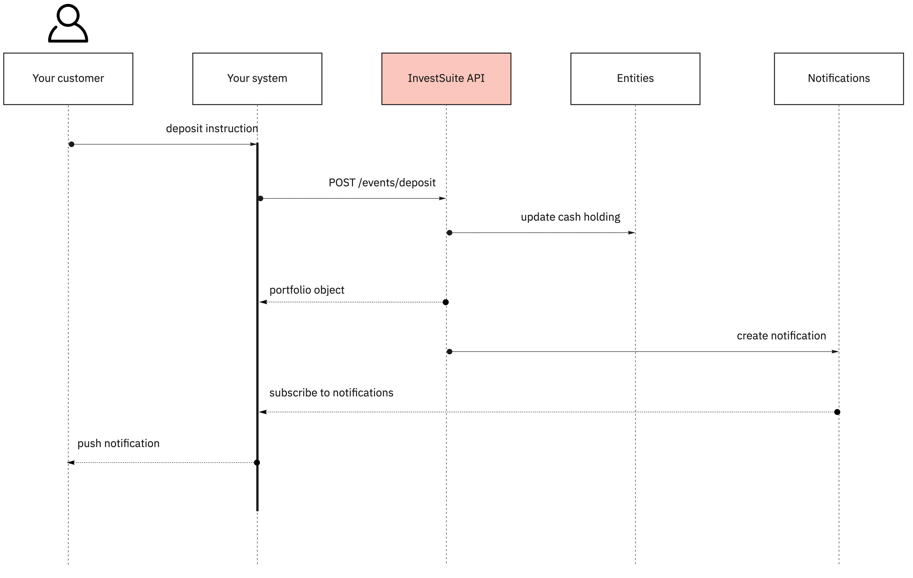
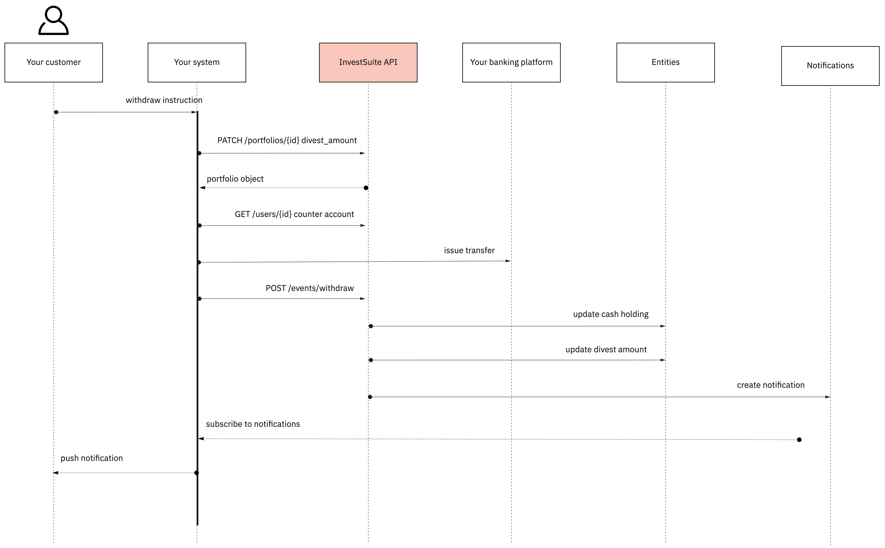

!!! Info
    Applicable to: Robo Advisor, Self Investor

## Context

There are two sorts of cash movements: deposits and withdrawals. You register a cash movement with InvestSuite when the movement is settled in the account of the customer in your core banking platform. This triggers us to take a number of actions on your behalf, depending on the setup we have agreed upon:

1. Update the cash holding in the targeted portfolio. In case of the Robo Advisor this will result in an optimization of the portfolio.
2. Create a transaction to publish in the transaction history presented to the customer.
3. In case InvestSuite handles the connection with the broker we will update the investment account at broker side.
4. Create a notification to inform the customer on the settlement. 



!!! Note
    Notifications are published to a (Kafka) message broker hosted by InvestSuite. InvestSuite develops and maintains white label front-ends that amongst others send push messages via the app based on those notifications. You can do the same in your front-end, or consume notifications for other use cases, for instance to create event feeds in your online banking platform for your customers. Reach out if this is something you would consider.

## Funding a portfolio

When your customer has tranferred cash into their cash account you give InvestSuite the instruction to update the portfolio cash holding so that in case of Self Investor the user can use the money to buy securities. In case of the Robo Advisor your instruction will lead to a portfolio optimization.

=== "HTTP"

    ```HTTP 
    POST /events/deposit/ HTTP/1.1
    Host: api.sandbox.investsuite.com
    Content-Type: application/json

    {
        "data": {
            "amount": "1000",
            "currency": "USD",
            "portfolio": "P01F8ZSNV0J45R9DFZ3D7D8C26F"
        }
    }

    ```

=== "curl"

    ```bash
    curl --location --request POST 'https://api.sandbox.investsuite.com/events/deposit/' \
    --header 'Content-Type: application/json' \
    --header 'Authorization: Bearer {string}' \
    --data-raw '{
                    "data": {
                        "amount": "1000",
                        "currency": "USD",
                        "portfolio": "P01F8ZSNV0J45R9DFZ3D7D8C26F"
                    }
                }'
    ```

## Cash withdrawal

Cash withdrawal takes two steps:

1. Reserve the amount to be withdrawn by setting that amount in the portfolio `divest_amount` field. As such the amount is reserved and cannot be used for investing. Then you transfer the money from the user's account in your system to the `counter_account` saved in the user object referred to from `Portfolio->owned_by_user_id`.
2. When the money has in fact been withdrawn from the customer's account in your banking system, you alert us by issuing `POST /events/withdraw/`. We then update the cash position, put the `divest_amount` field back to `null` and publish a notification event to the message broker to notify the user via front-end channels.

!!! Warning
    In certain cases the instruction to withdraw money comes from the front-end. It is the front-end integration that updates the `divest_amount` field, not your integration (remember: this API is designed for backend-to-backend communication). Still, it is you that has to transfer the cash from the user's account to the counter account. In that case you listen to our event queue to trigger such transer. See diagram below. 



=== "HTTP"

    ```HTTP 
    POST /events/deposit/ HTTP/1.1
    Host: api.sandbox.investsuite.com
    Content-Type: application/json

    {
        "data": {
            "amount": "1000",
            "currency": "USD",
            "portfolio": "P01F8ZSNV0J45R9DFZ3D7D8C26F"
        }
    }

    ```

=== "curl"

    ```bash
    curl --location --request POST 'https://api.sandbox.investsuite.com/events/withdraw/' \
    --header 'Content-Type: application/json' \
    --header 'Authorization: Bearer {string}' \
    --data-raw '{
                    "data": {
                        "amount": "1000",
                        "currency": "USD",
                        "portfolio": "P01F8ZSNV0J45R9DFZ3D7D8C26F"
                    }
                }'
    ```