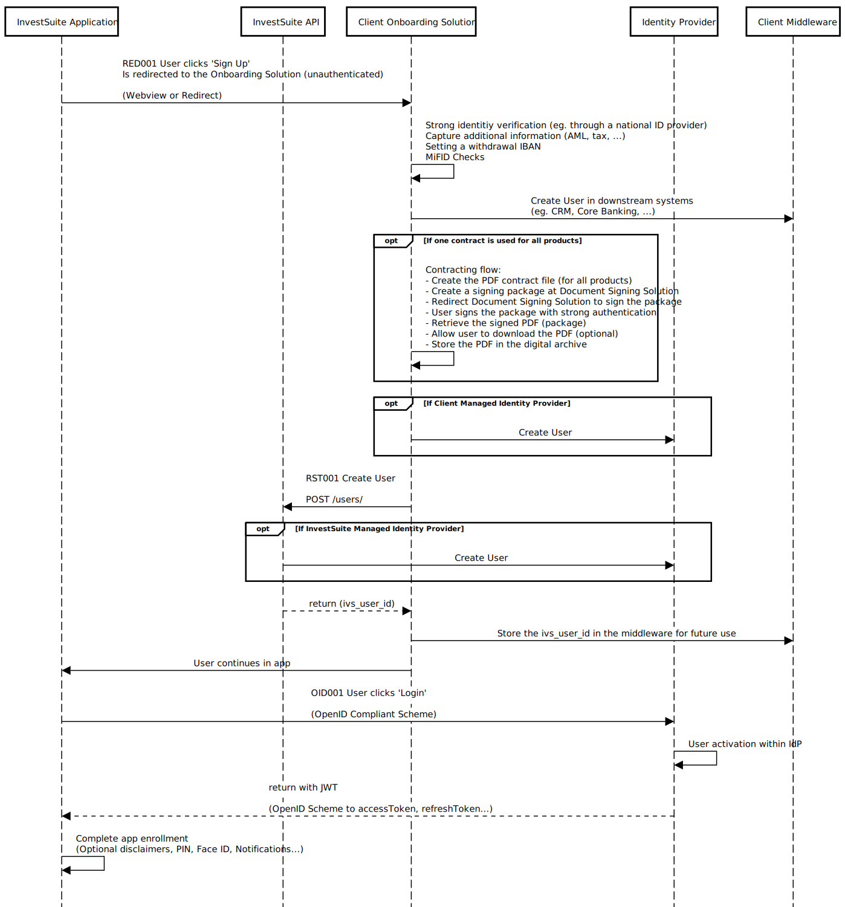

!!! warning
    This page is under construction
## Context

An Onboarding process varies wildly from client to client, but typically involves the following steps in any order:

* Strong identify verification (eg. through a national ID provider)
* Capture additional information (Anti Money-Laundering (AML) checks, tax information, ...)
* Setting a withdrawal IBAN
* Suitability test
* MiFID Checks
* Signing a contract
* Creation of a User in InvestSuite
* Creation of a Portfolio in InvestSuite, with the User as owner <!-- TODO WITH COUNTER ACCOUNT -->

Broadly speaking, the Onboarding process happens either outside the InvestSuite application (Scenario 1, also referred to as 'API Onboarding') or inside InvestSuite (Scenario 2, also referred to as 'In-App Onboarding').

The former is the preferred scenario as it requires less integration work and provides a smoother experience for your existing users.

## Choices to make

- Will the customer sign one contract for all products (per user) or one contract per product
- Will InvestSuite manage the Identity Provider (packaged within the InvestSuite platform) or will the Client (see the Supported 3rd Party list) <!-- TODO Add Link -->

## Scenario 1: API Onboarding
### Create User

**Use Case** 

The User onboards outside of InvestSuite: a third party application takes care of KYC checks, AML checks and contract signing, after which the user is created in InvestSuite.

**Sequence Diagram**

**API Calls**

RED001: A basic HTTP redirect to a web page which hosts the onboarding solution. This call is unauthenticated.
- RST001: POST /users

The below table shows the minimum required data you provide as an input when creating a user through the InvestSuite API.

Field | Description | How to provide
--- | --- | ---
create_idp_user | Set to `TRUE` if InvestSuite creates the user at the identity provider. | query parameter 
external_id | Your identifier for the user. | request body 
first_name | The first name of the user. Required if the user uses InvestSuite's front-end applications for investing. Displayed in the app. | request body 
last_name | The last name of the user. Required if InvestSuite creates the user at the identity provider. | request body
email | The email address of the user. Required if InvestSuite creates the user at the identity provider. | request body
phone | The mobile phone number of the user. Required if InvestSuite creates the user at the identity provider, only if 2-factor authentication is foreseen. | request body
language | The preferred communication language of the user. | request body
counter_account > bank_account_number_type | Type of the bank account number, typically an IBAN number. Required if the user uses InvestSuite's front-end applications for investing. | request body
counter_account > bank_account_number | Account number of the user to which money withdrawn from the user's portfolio will be settled. Required if the user uses InvestSuite's front-end applications for investing. Displayed in the withdrawal screen of the InvestSuite app. | request body
status | The status of the user. Always `ACTIVE` for this onboarding scenario. | request body

For the detailed specification of our endpoints, go to [InvestSuite API specification](https://api.sandbox.investsuite.com/redoc). 

<!-- TODO User Status Status
STATUS : contract signed or not -->

- OID001
- cg

CREATE USER: 

RST001

RST002 
update user status that contract has been signed

Suitability Profiler
EVT001 Event when an assessment is complete
EVT002 Event when a profile is complete
Get result of assessment in profile (IVR013)
Get suitability profile result (IVR014)

**How-To**

### Create Self Investor Portfolio

**Use Case** 

You create a Self Investor portfolio for a fully onboarded user. The user is already created in InvestSuite.

**How-To**

The below table shows the minimum required data you provide as an input when creating a portfolio through the InvestSuite API.

Field | Description | How to provide
--- | --- | ---
external_id | Your identifier for the portfolio. | request body 
name | The portfolio name. Required if the user uses InvestSuite's front-end applications for investing. Displayed in the InvestSuite app. | request body 
owned_by_user_id | The portfolio owner's user id. | request body
base_currency | The base currency of the portfolio. | request body
money_type | Always `REAL_MONEY` for a Self Investor portfolio. | request body 
config > manager | Always `SELF_MANAGED` for a Self Investor portfolio. | request body
config > manager_version | Always `1` for a Self Investor portfolio. | request body
brokerage_account > bank_account_type | Type of the bank account number, typically an IBAN number. | request body
brokerage_account > bank_account_number | Account number of the account to which the user should transfer money for funding the portfolio. This can be a pooled account or an account specifically for the portfolio. Required if the user uses InvestSuite's front-end applications for investing. Displayed in the funding screen of the InvestSuite app. | request body
brokerage_account > payment_reference | Payment reference the user needs to add to the bank transfer for funding the portfolio. Required if the user uses InvestSuite's front-end applications for investing and the portfolio is funded through a pooled account. Displayed in the funding screen of the InvestSuite app. | request body

For the detailed specification of our endpoints, go to [InvestSuite API specification](https://api.sandbox.investsuite.com/redoc). 

### Create Robo Advisor Portfolio

Under construction

## Scenario 2: In-App Onboarding

### Create User

Under construction
### Create Self Investor Portfolio

Under construction

### Create Robo Advisor Portfolio

Under construction