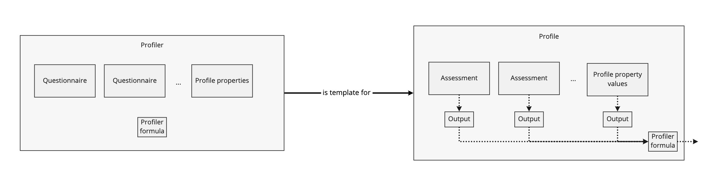
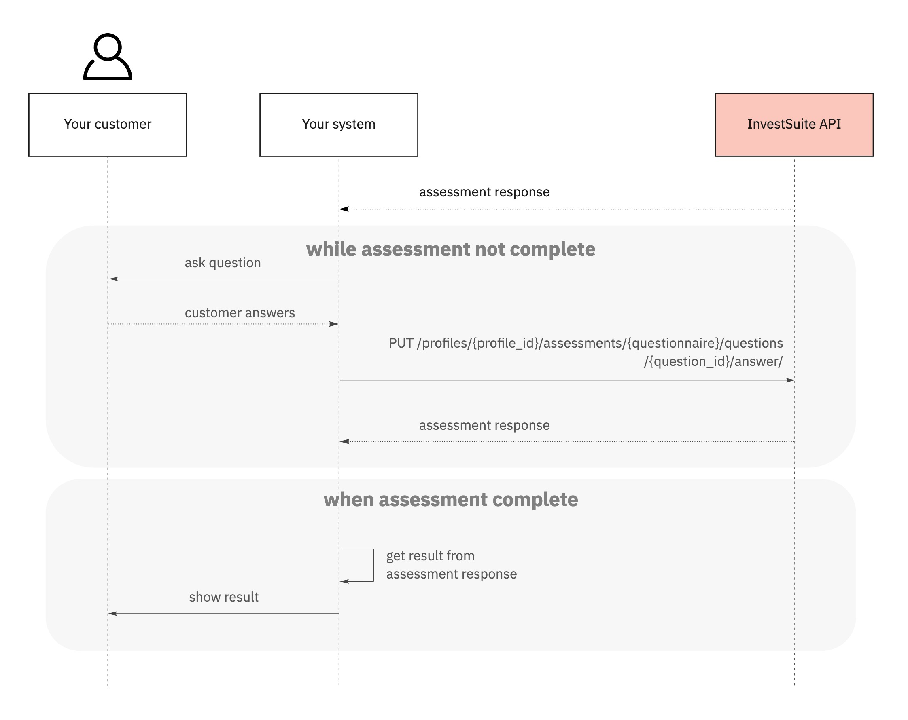

## Context

A suitability profiler captures the information needed to create a suitable portfolio for someone. Part of this is creating a risk profile, other information can include preferences on sustainable investing or specific investment themes. Through one or more assessments in a suitability profile, this information can be gathered and translated into characteristics of a suitable portfolio.

One application of an assessment in the suitaibility profiler is assessing the willingness to take risk. InvestSuite has conducted a lot of research together with universities to create a risk profiler that evaluates in an engaging and human way someone's willingness and ability to take risk. InvestSuite risk profile questionnaires can be MiFID 2-compliant, have dynamic pathways and logic jumps, and have questions based on real numbers specific to the user. For each client, InvestSuite creates and stores one or more custom questionnaires, that the client can use to assess their users' risk profile.

## Definitions

**Profile** - A profile is a portfolio-specific object that captures the information necessary to create a suitable portfolio. It contains one or more assessments, each assessing a certain aspect of the suitability profile. The results of the assessments are translated into parameters, that can then be used to define a policy for creating a suitable portfolio.

**Profiler** - A profiler determines the structure of a profile. It contains questionnaires, that determine what the assessments in the profile will look like. A profiler is essentially a template for a portfolio-specific suitability profile.

**Questionnaire** - A questionnaire determines the logic that is used to fill out parameters in the risk profile. It determines the content of questions that will be asked, and the (dynamic) pathway of questions. 

**Assessment** - An assessment follows the questions of a questionnaire, and holds the progress of the user. For each portfolio the user takes an assessment. As such, as assessment is specific to a portfolio.



## How it works

As mentioned above, to come to guidelines for a suitable portfolio, the user must go through one or more assessments in their suitability profile to capture the necessary information.
Once designed and configured a profiler together with InvestSuite, it is possible to generate a profile. For each portfolio, a profile can be created based on a profiler. This profiler acts as a template for a specific profile. It determines which assessments will be asked and how the gathered information is translated into guidelines. All assessments in the profile object should be completed by the user in order to determine a suitable policy.

At the end of an assessment, the InvestSuite API returns a result. The client can use this result to determine the right investing strategy for the user. The formula on how to calculate the result is determined by the client in the profiler, which means that there are no customisation constraints. Parameters in the suitability profile of a user do not all have to contribute to the eventual result. For example, the birth date of the user is a required parameter in order to determine whether the user is old enough to open an investment account, but it does not influence the risk score.  

Because there can be logic jumps in the question order of an assessment (and the next question can depend on the previous answers), only the next question to be asked and previously answered questions are given in each assessment response. After an answer is submitted, Investsuite immediately stores it in the suitability profile. This way, a user can close the application at any time without losing their progress, and can resume the assessment later.

## Create profile

When a user is created, it is possible to create a profile with the user ID. To create a profile for a user, a user ID and profiler ID are required. The user ID is the ID that is used by InvestSuite to uniquely identify the user. You can find the user ID by querying the *User* collection `GET /users/?query=…`, see the [Search users](/docs/common_scenarios/users/#search) section for more information. The profiler ID identifies the profiler that will be used as template for the profile. This profiler is specific to the customer and is designed and configured together with InvestSuite. Let's try it out and create a profile for a specific `user_id` and `profiler_id`.

=== "HTTP"

    ```HTTP 
    POST /suitability-profiler/profiles/ HTTP/1.1
    Host: api.sandbox.investsuite.com
    Content-Type: application/json
    Authorization: Bearer {string}

    {
        "profiler_id": "Q01ARZ3NDEKTSV4RRFFQ69G5FAV",
        "user_id": "U01ARZ3NDEKTSV4RRFFQ69G5FAV",
    }

    ```

=== "curl"

    ```bash
    curl -X POST \                 
    -H "Content-Type: application/json" \
    -H "Auhorization": "{string}"  \   
    -d '{  \   
            "profiler_id": "Q01ARZ3NDEKTSV4RRFFQ69G5FAV",  \
            "user_id": "U01ARZ3NDEKTSV4RRFFQ69G5FAV",  \
        }'
    https://api.sandbox.investsuite.com/suitability-profiler/profiles/
    ```

Field | Description | Data type | Example | Required
----- | ----------- | --------- | ------- | --------
`profiler_id` | A unique identifier for the profiler to be used as template for the profile. This field is required for knowing which assessments to add to the profile. | `string ^À[0-9A-HJKMNP-TV-Z]{26}\Z` | À01ARZ3NDEKTSV4RRFFQ69G5FAV | yes 
`user_id` | The user ID of the person that this profile is for. | `string ^U[0-9A-HJKMNP-TV-Z]{26}\Z` | U01ARZ3NDEKTSV4RRFFQ69G5FAV | yes

**Response body** 
```JSON
{
    "id": "M01ARZ3NDEKTSV4RRFFQ69G5FAV"
}
```
Now that we created the profile, we can start asking questions to the user. The now empty assessments of the profile will be filled out sporadically by submitting answers via the API.  

## Retrieve assessment  

When a profile is created for a user, we can start conducting the assessments in order to complete the profile. As mentioned above, each assessment is linked to a questionnaire, that determines what the assessment looks like. This questionnaire ID in combination with the ID of the created profile uniquely determine an assessment. Let us give an example of how to retrieve an assessment.  

=== "HTTP"

    ```HTTP 
    POST /suitability-profiler/profiles/{profile_id}/assessments/{questionnaire_id} HTTP/1.1
    Host: api.sandbox.investsuite.com
    Content-Type: application/json
    Authorization: Bearer {string}

    ```

=== "curl"

    ```bash
    curl -X POST \                 
    -H "Content-Type: application/json" \
    -H "Auhorization": "{string}"  \   
    https://api.sandbox.investsuite.com/suitability-profiler/profiles/{profile_id}/assessments/{questionnaire_id}
    ```

Field | Description | Data type | Example | Required
----- | ----------- | --------- | ------- | --------
`profile_id` | A unique identifier of the profile that this assessment is for. | `string ^N[0-9A-HJKMNP-TV-Z]{26}\Z` | N01ARZ3NDEKTSV4RRFFQ69G5FAV | yes 
`questionnaire_id` | The ID of the questionnaire that this assessment is based on. | `string ^M[0-9A-HJKMNP-TV-Z]{26}\Z` | U01ARZ3NDEKTSV4RRFFQ69G5FAV | yes

**Response body** 
```JSON
{
    "sections": [
        {
            "answered_questions": [], 
            "title": {
                "en-us": "Introduction",
            }, 
            "question_count": 3,
        }, 
        {
            "answered_questions": [], 
            "title": {
                "en-us": "Investment Goals",
            }, 
            "question_count": 10,
        }, 
    ],
    "status": {
        "section_index": 0,
        }, 
        "question": {
            "form": {
                "control_type": "OK", 
                "type": "CONTROL",
            },
            "title": "Welcome", 
            "body": "In the next minutes, we'll help you create your own, personalized investment portfolio. But first we want to explain how this works.",
            "index": "0", 
            "id": "D01ARZ3NDEKTSV4RRFFQ69G5FAV",
        }, 
        "type": "IN_PROGRESS",
    }
}
```

## Conduct assessment

After a profile is created for a user, the assessing can begin. Conducting an assessment is done by asking a question to the user, submitting the answer to InvestSuite, receiving the next question to ask from InvestSuite, asking that question to the user, and so on until the assessment is completed. An assessment will have a status COMPLETE and show a result when all questions are answered. When there are still questions to be answered, the assessment has a status IN_PROGRESS and contains a next question to ask.  

After receiving an answer from the user, the answer is submitted to InvestSuite in order to get the next question. InvestSuite saves the answer immediately and determines the next question. This way, InvestSuite keeps track of and saves the progress of the assessment, so the user can close the application any time and resume the assessment where they left off later. 



Both calls in the sequence diagram have the same response body, containing the next question to be asked or the score, the parameters, the sections with the answered questions, and a status. 

**Response body** 
```JSON
{
    "sections": [
        {
            "answered_questions": [
                {
                    "value": {
                        "form": {
                            "control_type": "OK", 
                            "type": "CONTROL",
                        },
                        "title": "Welcome", 
                        "body": "In the next minutes, we'll help you create your own, personalized investment portfolio. But first we want to explain how this works.",
                        "index": "0", 
                        "id": "D01RRZ3NDDKTSK4RRFFQ69G5FAV",
                    }, 
                    "answer": {
                        "type": "OK"
                    }
                }
            ], 
            "title": {
                "en-us": "Introduction",
            }, 
            "question_count": 3,
        }, 
        {
            "answered_questions": [], 
            "title": {
                "en-us": "Investment Goals",
            }
        }, 
    ],
    "status": {
        "section_index": 0,
        "question": {
            "form": {
                "control_type": "OK", 
                "type": "CONTROL",
            },
            "title": "More information", 
            "body": "Robo Advisor invests in Exchange Traded Funds (ETFs), which are made from underlying instruments like stocks or bonds, and follows an index.",
            "index": "1", 
            "id": "D01ARZ3NDEKTSV4RRFFQ69G5FAV",
        }, 
        "type": "IN_PROGRESS",
    },
}
```  
