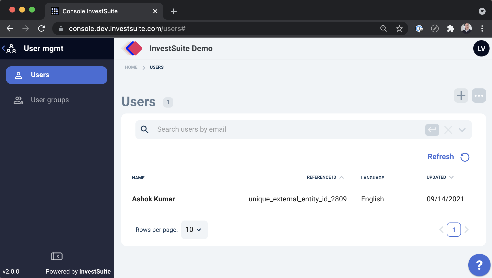
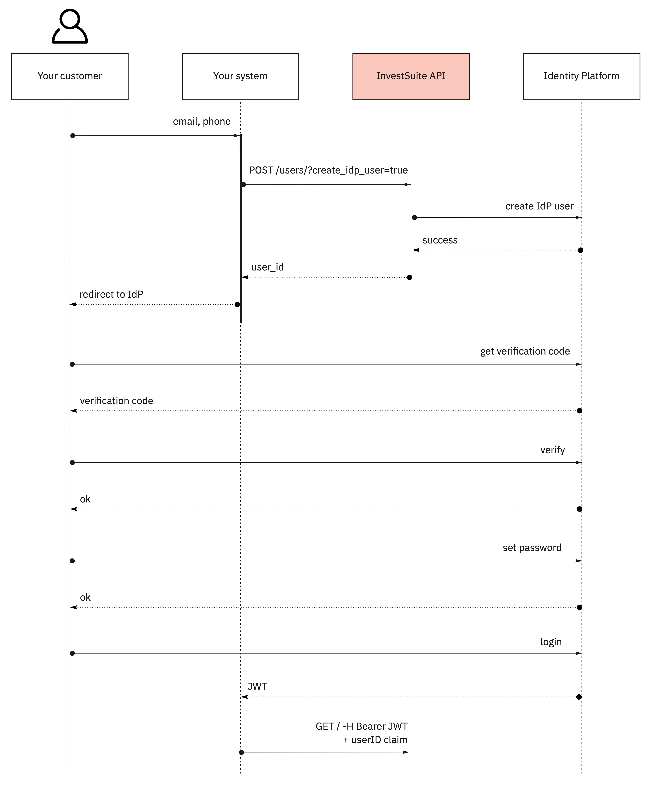
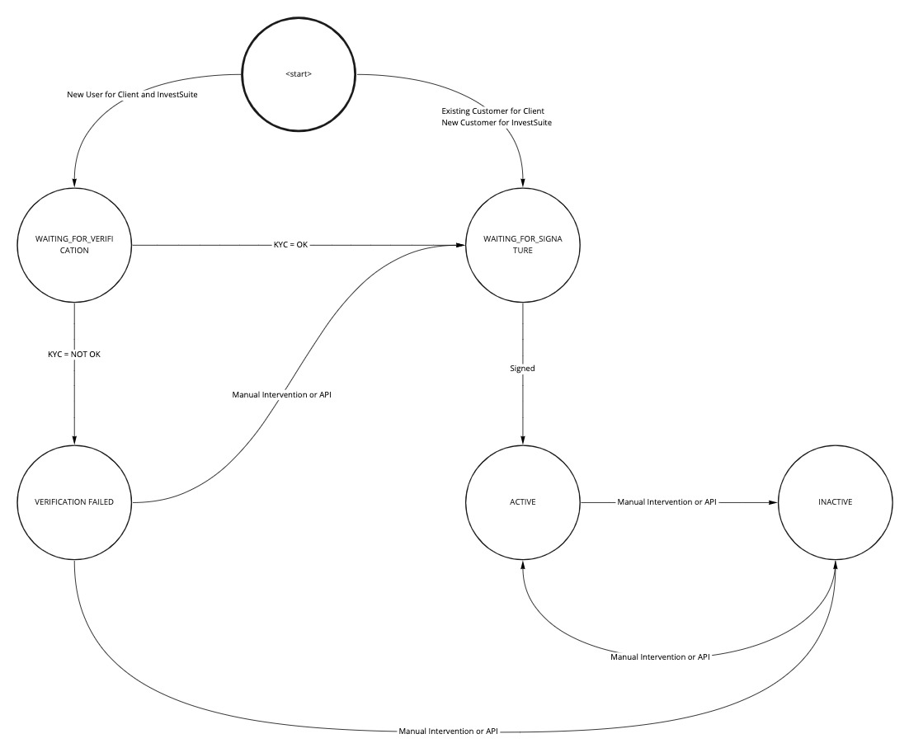

## Context

This page lists all operations that can be performed on the User object, see See [Glossary](../getting_started/glossary.md).

## Create a user

Typically a User is created with a name and an External ID, but none are required by the API and all can be updated later, as needed or as allowed by law.

Depending on which products the User uses, fields become required from a fuctional point of view. For example, you can create a user without a name, but when using Self Investor (or any other application with a frontend), the user will not be able to use that product if no name is specified.

### Minimum user

=== "HTTP"

    ```HTTP 
    POST /users/ HTTP/1.1
    Host: api.sandbox.investsuite.com
    Content-Type: application/json
    Authorization: Bearer {string}
    {
    }

    ```

=== "curl"

    ```bash
    curl -X POST \                 
    -H "Content-Type: application/json" \
    -H "Auhorization": "{string}"  \   
    -d '{  \   
        }'
    https://api.sandbox.investsuite.com/users/
    ```

=== "Response (Body)"

    ```JSON
    {
        "external_id": "null",
        "id": "U01ARZ3NDEKTSV4RRFFQ69G5FAV",
        "creation_datetime": "2021-02-18T08:21:02+00:00",
        "version": 1,
        "version_datetime": "2021-02-18T08:21:02+00:00",
        "version_authored_by_user_id": "U01ARZ3NDEKTSV4RRFFQ69G5FAV",
        "deleted": false,
        "first_name": null,
        "last_name": null,
        "status": "WAITING_FOR_VERIFICATION"
    }
    ```

### Typical user

=== "Request"

    ```HTTP
    POST /users/ HTTP/1.1
    Host: api.sandbox.investsuite.com
    Content-Type: application/json
    Authorization: Bearer {string}
    {
        "external_id": "unique_external_identity_id_2809",
        "first_name": "Ashok",
        "last_name": "Kumar",
        "email": "ashok.kumar@example.com",
        "phone": "+123456789",
        "counter_account": {
            bank_account_number: "BE01234567891234",
            bank_account_type: "IBAN",
            bank_id: "IDQMIE2D"
        },
        "language": "en-US"
        "status": "WAITING_FOR_VERIFICATION"
    }

    ```
=== "Response (body)"

    ```JSON
    {
        "external_id": "unique_external_identity_id_2809",
        "id": "U01ARZ3NDEKTSV4RRFFQ69G5FAV",
        "creation_datetime": "2021-02-18T08:21:02+00:00",
        "version": 1,
        "version_datetime": "2021-02-18T08:21:02+00:00",
        "version_authored_by_user_id": "U01ARZ3NDEKTSV4RRFFQ69G5FAV",
        "deleted": false,
        "first_name": "Ashok",
        "last_name": "Kumar",
        "email": "ashok.kumar@example.com",
        "phone": "+123456789",
        "language": "en-US"
    }
    ```

Field | Description | Data type | Example | Required
----- | ----------- | --------- | ------- | --------
`external_id` | A unique external identifier for this entity, also referred to as Reference ID. This identifier can be any string used in your system to identify this entity. | `string <= 64 characters` | unique_external_entity_id | No 
`first_name` | The first name of the user. | `string <= 128 characters` | Ashok | Required if the user uses InvestSuite's front-end applications for investing. Displayed in the app.
`last_name` | The last name of the user. | `string <= 128 characters` | Kumar | Required if the user uses InvestSuite's front-end applications for investing. Displayed in the app.
`email` | The email address of the user. | | | Required if InvestSuite creates the user at the identity provider.
`phone` | The mobile phone number of the user. | | | Required if InvestSuite creates the user at the identity provider, only if 2-factor authentication is foreseen.
`language` | The preferred communication language of the user. | | | No
`counter_account > bank_account_number_type` | Type of the bank account number, typically an IBAN number. | | | Required if the user uses InvestSuite's front-end applications for investing.
`counter_account > bank_account_number` | Account number of the user to which money withdrawn from the user's portfolio will be settled. | | | Required if the user uses InvestSuite's front-end applications for investing. Displayed in the withdrawal screen of the InvestSuite app. | request body
`status` | The status of the user. See [Status](#update-the-status) | | | No

The user is now visible in the Admin Console:



## Create a login

!!! info

    Only applicable if the identity provider (IdP) is managed by InvestSuite (see Onboarding).

To create credentials for the user to log in, specify the `create_idp_user` query parameter and the `email` and `phone` fields.

!!! warning

    The IdP will probably require that `email` and `phone` are unique.

    These fields are _write once_. You cannot update them.


=== "HTTP"

    ```HTTP
    POST /users/?create_idp_user=true HTTP/1.1
    Host: api.sandbox.investsuite.com
    Content-Type: application/json
    Authorization: Bearer {string}

    {
        "first_name": "Ashok",
        "last_name": "Kumar",
        "email": "ashok.kumar@example.com",
        "phone": "+12345667"
    }

    ```

=== "curl"

    ```bash
    curl -X POST \                 
    -H "Content-Type: application/json" \
    -H "Auhorization": "{string}"  \   
    -d '{  \   
            "external_id": "unique_external_entity_id",  \   
            "first_name": "Ashok", \
            "last_name": "Kumar", \
            "email": "ashok.kumar@example.com", \
            "phone": "+123456789"
        }'
    https://api.sandbox.investsuite.com/users/?create_idp_user=true
    ```


Field | Description | Data type | Example | Required
----- | ----------- | --------- | ------- | --------
`email` | The e-mail address of the user. Unique and write once. | `email` | ashok.kumar@example.com | yes
`phone` | The mobile phone number of the user in international format. Unique and write once. | `string (^\+[1-9][0-9]{7,15}\Z)` | +123456789 | yes

After creating the user, the IdP is responsible for completing the registration on its behalf. Typically this involves the IdP sending an email to reset the password and complete additional details.



## Get a user

Add the InvestSuite ID to the path to retrieve a user object.

=== "Request"

    ```HTTP
    GET /users/U01F8YW5NJXMF78PMFKXTE2R7Q7 HTTP/1.1
    Host: api.sandbox.investsuite.com
    Authorization: Bearer {string}
    ```

=== "Response (body)"

    ```JSON
    {
        "external_id": "unique_external_entity_id",
        "readable_by": [
            "U01ARZ3NDEKTSV4RRFFQ69G5FAV"
        ],
        "modifiable_by": [
            "U01ARZ3NDEKTSV4RRFFQ69G5FAV"
        ],
        "id": "U01ARZ3NDEKTSV4RRFFQ69G5FAV",
        "creation_datetime": "2021-02-18T08:21:02+00:00",
        "version": 3,
        "version_datetime": "2021-02-18T08:21:02+00:00",
        "version_authored_by_user_id": "U01ARZ3NDEKTSV4RRFFQ69G5FAV",
        "deleted": false,
        "_embedded": {},
        "first_name": "Jane",
        "last_name": "Doe",
        "email": "jane.doe@example.com",
        "phone": "+123456789",
        "brokerage_user_id": "12345678",
        "idp_user_id": "user_idp_identity",
        "language": "en-US"
    }
    ```
## Update a user

Given the right permissions you can update any object by issuing a `PATCH` request.

!!! Warning
    Not all fields can be updated, eg. the `phone` and `email` fields can only be set once. You can update these fields: `external_id`, `first_name`, `last_name`, `counter_account`, `language`.

### Update the language

=== "Request"

    ```HTTP
    PATCH /users/U01F8YW5NJXMF78PMFKXTE2R7Q7 HTTP/1.1
    Host: api.sandbox.investsuite.com
    Accept-Encoding: gzip, deflate
    Connection: Keep-Alive
    Content-Type: application/json
    Authorization: Bearer {string}
    {
        "language": "be-NL"
    }

    ```

=== "Response (body)"

    ```JSON hl_lines="13"
    {
        "external_id": "unique_external_entity_id",
        "id": "U01ARZ3NDEKTSV4RRFFQ69G5FAV",
        "creation_datetime": "2021-02-18T08:21:02+00:00",
        "version": 3,
        "version_datetime": "2021-02-18T08:21:02+00:00",
        "version_authored_by_user_id": "U01ARZ3NDEKTSV4RRFFQ69G5FAV",
        "deleted": false,
        "first_name": "Jane",
        "last_name": "Doe",
        "email": "jane.doe@example.com",
        "phone": "+123456789",
        "language": "be-NL"
    }
    ```

### Update the counter account

Counter Account: see [Glossary](../getting_started/glossary.md#accounts).

You can optionally add a counter account during user creation; or afterwards by patching the user object. This is used to display to your customer the account that is funded in case of a withdrawal instruction. 

=== "HTTP"

    ```HTTP 
    PATCH /users/ HTTP/1.1
    Host: api.sandbox.investsuite.com
    Content-Type: application/json
    Authorization: Bearer {string}

    {
        "external_id": "unique_external_entity_id",
        "first_name": "Ashok",
        "last_name": "Kumar",
        "email": "ashok.kumar@example.com",
        "phone": "+12345667",
        "counter_account": {
            "bank_account_number": "BE01234567891234",
            "bank_account_number_type": "IBAN",
            "bank_id": "IDQMIE2D",
            "bank_id_type": "BIC"
        }
    }

    ```

=== "curl"

    ```bash
    curl --location --request PATCH 'https://api.sandbox.investsuite.com/users/' \
    --header 'Content-Type: application/json' \
    -H "Auhorization": "{string}"  \   
    --data-raw '{
            "external_id": "unique_external_entity_id",
            "first_name": "Ashok",
            "last_name": "Kumar",
            "email": "ashok.kumar@example.com",
            "phone": "+12345667",
            "counter_account": {
                "bank_account_number": "BE01234567891234",
                "bank_account_number_type": "IBAN",
                "bank_id": "IDQMIE2D",
                "bank_id_type": "BIC"
            }
        }'
    ```

Field | Description | Data type | Example | Required
----- | ----------- | --------- | ------- | --------
`bank_account_number` | Account number of the user for withdrawal instructions. | `string ^[A-Z]{2}[A-Z0-9]{14,30}\Z` | BE01234567891234 | yes
`bank_account_number_type` | Type of the bank account number that is associated with this portfolio, typically an IBAN number. | `enum("ABA", "IBAN")` | IBAN | yes
`bank_id` | Bank identifier code or ID of the bank used for routing instructions, typically a BIC identifier. | `string AnyOf("^[0-9]{9}\Z", "^[A-Z]{4}[A-Z]{2}[A-Z0-9]{2}([A-Z0-9]{3})?\Z")` | IDQMIE2D | no
`bank_id_type` | Bank identifier code type. | `string AnyOf("BIC", "ABA")` | BIC | no

### Update the status

The user status is used throughout the onboarding process, and defines where the user is in that process. Some capabilities may be unaccessible as long as the user is not fully onboarded.

=== "Request"

    ```HTTP
    PATCH /users/U01F8YW5NJXMF78PMFKXTE2R7Q7 HTTP/1.1
    Host: api.sandbox.investsuite.com
    Accept-Encoding: gzip, deflate
    Connection: Keep-Alive
    Content-Type: application/json
    Authorization: Bearer {string}
    {
        "status": "WAITING_FOR_SIGNATURE"
    }

    ```

**State Transitions**
!!! Note
    
    The API does not enforce a specific sequence.
    

<!-- Source: https://miro.com/app/board/uXjVOJ6Msys=/?moveToWidget=3458764529579357726&cot=14 -->

<!-- TODO Describe statusses
TODO Describe status if mulitple contracts -->

## Delete a user

Given the right permissions you can delete any object by issuing a `DELETE` request.

=== "Request"

    ```HTTP hl_lines="1"
    DELETE /users/U01F8YW5NJXMF78PMFKXTE2R7Q7 HTTP/1.1
    Host: api.sandbox.investsuite.com
    Accept-Encoding: gzip, deflate
    Connection: Keep-Alive
    Content-Type: application/json
    Authorization: Bearer {string}
    ```

=== "Response (body)"

    ```JSON 
    {
        "external_id": "unique_external_entity_id",
        "id": "U01ARZ3NDEKTSV4RRFFQ69G5FAV",
        "creation_datetime": "2021-02-18T08:21:02+00:00",
        "version": 3,
        "version_datetime": "2021-02-18T08:21:02+00:00",
        "version_authored_by_user_id": "U01ARZ3NDEKTSV4RRFFQ69G5FAV",
        "deleted": true,
        "first_name": "Jane",
        "last_name": "Doe",
        "email": "jane.doe@example.com",
        "phone": "+123456789",
        "language": "en-US"
    }
    ```

## Query users

You can query each entity collection with the `query` parameter e.g. `GET /users/?query=…`. Learn more in the [Handling collection responses](./collections.md) section.

=== "Request"

    ```HTTP hl_lines="1"
    GET /users
        ?query=email+eq+'jane*' HTTP/1.1
    Host: api.sandbox.investsuite.com
    Authorization: Bearer {string}
    ```

=== "Response (body)"

    ```JSON 
    {
        "external_id": "unique_external_entity_id",
        "id": "U01ARZ3NDEKTSV4RRFFQ69G5FAV",
        "creation_datetime": "2021-02-18T08:21:02+00:00",
        "version": 3,
        "version_datetime": "2021-02-18T08:21:02+00:00",
        "version_authored_by_user_id": "U01ARZ3NDEKTSV4RRFFQ69G5FAV",
        "deleted": false,
        "first_name": "Jane",
        "last_name": "Doe",
        "email": "jane.doe@example.com",
        "phone": "+123456789",
        "language": "en-US"
    }
    ```
