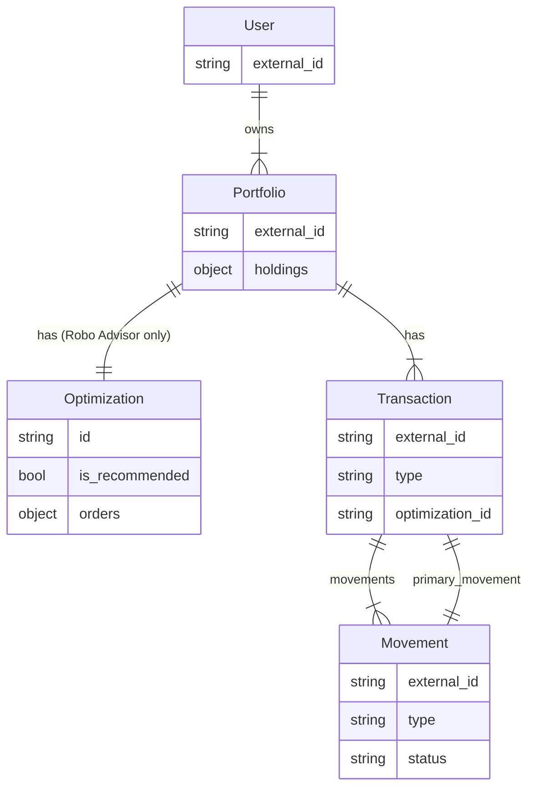
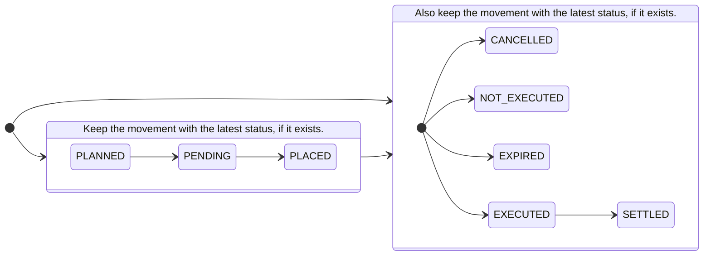

!!! info "Definition"

    See the [Glossary](../concepts/glossary.md#holdings-orders-transactions-and-movements) for a definition.

## Context

The broker/custodian is the master system for [transactions and holdings (positions)](../concepts/glossary.md#holdings-orders-transactions-and-movements). These need to be kept in sync with InvestSuite. In case of broker integration by the client (see [integration architecture](architecture.md)), this page describes how.

!!! question "First transactions, or first orders?"

    We recommend to first create (update) the transaction, and then update the portfolio holdings.

## Concepts



### Transactions

#### Types
The following types of transactions exist:

1. *Order* transactions: buying/selling of instruments, containing one or more movements (see [example](#order-placed)).
2. *Cash* transactions: a deposit of cash, a divestment, fees or tax (see [example](#cash)).
3. *Corporate Action* transactions, eg. stock split or distribution of dividends, can but does not need to include one or more movements (see [example](#corporate-action)).
4. *Security Transfer* transaction: at least 1 movement <!-- TODO describe what this is, add an example -->
5. *Administrative* transaction <!-- TODO describe what this is, add an example -->

#### Status

The Status of a Transaction is determined by the statuses of the Movements it comprises. 

See the [Movement status](#status_1).
<!-- https://investsuite.slack.com/archives/CDYGVNQKE/p1661328253880169?thread_ts=1661250223.596519&cid=CDYGVNQKE -->

### Movements

- A Transaction has one or more Movements.
- A Transaction has one Primary Movement: the one that 'triggers' the other movement.

#### Types
The following types of movements exist: `CASH_DEPOSIT`, `CASH_DIVIDEND`, `CASH_WITHDRAWAL`, `COUPON`, `BUY`, `SELL`, `CORPORATE_ACTION_IN`, `CORPORATE_ACTION_OUT`, `REVERSE_STOCK_SPLIT`, `STOCK_DIVIDEND`, `STOCK_SPLIT`, `TRANSFER_IN`, `TRANSFER_OUT`, `CUSTODY_FEE`, `INSTRUMENT_ENTRY_EXIT_FEE`, `MANAGEMENT_FEE`, `OTHER_FEE`, `OTHER_TAX`, `SERVICE_ENTRY_EXIT_FEE`, `TRANSACTION_FEE`, `WITHHOLDING_TAX`.

#### Status
A movement has the following statuses: `PLANNED`, `PENDING`, `PLACED`, `EXECUTED`, `SETTLED`, `CANCELLED`, `NOT_EXECUTED`, `EXPIRED`.

## Create transaction

### Order `PLACED`

!!! warning "Robo Advisor & Optimization ID"

    For Robo Advisor, include the `optimization_id` field (from `Optimization.id`).
    
    This field is used to reconcile whether the Optimization is fully executed.
    While an Optimization is in progress (ie. the [rebalancing process](../robo/rebalancing.md) is in progress), the Portfolio is blocked from making withdrawals.

    For Orders that originate from an Optimization, include the `optimization_id`.

!!! warning "Quantity type"

    Funds are typically bought per amount, not per unit.

    The convention is that the `quantity` field is set to 1, the amount in the `unit_price` field and (optionally) specify the `unit_price_currency`.

    See the "Request (Amount)" example below.
<!-- NOTE this is in use at Odea and ARC -->

#### Buy

=== "Request (Units)"

    ```HTTP hl_lines="8 11 12"
    POST /portfolios/P01FGVEKTV86PPKQVRK9CHT31JR/transactions/ HTTP/1.1
    Host: api.sandbox.investsuite.com
    Content-Type: application/json
    Authorization: Bearer {string}

    {
        "external_id": "your-transaction-id-1",
        "optimization_id": "O01ARZ3NDEKTSV4RRFFQ69G5FAV", // Robo Advisor only
        "movements": [
            {
                "type": "BUY",
                "status": "PLACED",
                "datetime": "2022-06-10T07:49:26.341Z",
                "instrument_id": "LU78468R1014",
                "quantity": 7
            }
        ]
    }
    ```

=== "Request (Amount)"

    ```HTTP hl_lines="15 16 17"
    POST /portfolios/P01FGVEKTV86PPKQVRK9CHT31JR/transactions/ HTTP/1.1
    Host: api.sandbox.investsuite.com
    Content-Type: application/json
    Authorization: Bearer {string}

    {
        "external_id": "your-transaction-id-1",
        "optimization_id": "O01ARZ3NDEKTSV4RRFFQ69G5FAV",
        "movements": [
            {
                "type": "BUY",
                "status": "PLACED",
                "datetime": "2022-06-10T07:49:26.341Z",
                "instrument_id": "LU78468R1014",
                "quantity": 1,
                "unit_price": "1000",
                "unit_price_currency": "EUR"
            }
        ]
    }
    ```

=== "Response (body)"

    ```JSON
    {
        "external_id": "your-transaction-id-1",
        "movements": [
            {
                "type": "BUY",
                "status": "PLACED",
                "datetime": "2022-06-10T07:49:26.341Z",
                "instrument_id": "LU78468R1014",
                "quantity": 7
            }
        ],
        "id": "T01FHCP1CZ9F1S207KJHNA5V244",
        "creation_datetime": "2021-10-07T06:11:22.217585+00:00",
        "version": 2,
        "version_datetime": "2021-10-08T06:15:51.106890+00:00",
        "version_authored_by_user_id": "UXXXXXXXXXXXXXXXXXXXXXXXXXX",
        "deleted": false
    }
    ```  

#### Sell

!!! info

    A sell transaction is the reverse of a buy order. This example is identical to the Buy transaction example in this page, other than `type` is `SELL` (not `BUY`) and the signs of the cash movement inverted.

=== "Request"

    ```HTTP hl_lines="8 11 12"
    POST /portfolios/P01FGVEKTV86PPKQVRK9CHT31JR/transactions/ HTTP/1.1
    Host: api.sandbox.investsuite.com
    Content-Type: application/json
    Authorization: Bearer {string}

    {
        "external_id": "your-transaction-id-1",
        "optimization_id": "O01ARZ3NDEKTSV4RRFFQ69G5FAV",
        "movements": [
            {
                "type": "SELL",
                "status": "PLACED",
                "datetime": "2022-06-10T07:49:26.341Z",
                "instrument_id": "LU78468R1014",
                "quantity": 7
            }
        ]
    }
    ```

=== "Response (body)"

    ```JSON
    {
        "external_id": "your-transaction-id-1",
        "movements": [
            {
                "type": "SELL",
                "status": "PLACED",
                "datetime": "2022-06-10T07:49:26.341Z",
                "instrument_id": "LU78468R1014",
                "quantity": 7
            }
        ],
        "id": "T01FHCP1CZ9F1S207KJHNA5V244",
        "creation_datetime": "2021-10-07T06:11:22.217585+00:00",
        "version": 2,
        "version_datetime": "2021-10-08T06:15:51.106890+00:00",
        "version_authored_by_user_id": "UXXXXXXXXXXXXXXXXXXXXXXXXXX",
        "deleted": false
    }
    ``` 

### Cash

Transactions that hold cash movements represent to InvestSuite movements on the investment account. That account is usually different from the current account, which is the account that the client holds with the bank. We expect in other words transactions on your brokerage system, not from your core banking platform.

#### Funding

=== "Request"

    ```HTTP hl_lines="10 14"
    POST /portfolios/P01FGZK41MJ4NJXKZ27VJC0HGS9/transactions/ HTTP/1.1
    Host: api.sandbox.investsuite.com
    Content-Type: application/json
    Authorization: Bearer {string}

    {
        "external_id": "P01FHAR57WS6Q8AV1GH5EATYKP1/14031738752",
        "movements": [
            {
                "type": "CASH_DEPOSIT",
                "status": "EXECUTED",    // or "SETTLED"
                "datetime": "2021-10-06T00:00:00+00:00",
                "instrument_id": "$USD",
                "quantity": 500.0,
            }
        ]
    }
    ```

!!! warning "Update Portfolio holdings"

    Also [update the Portfolio holdings](portfolios.md#holdings) after this call.

#### Withdrawal

=== "Request"

    ```HTTP hl_lines="10 14"
    POST /portfolios/P01FGZK41MJ4NJXKZ27VJC0HGS9/transactions/ HTTP/1.1
    Host: api.sandbox.investsuite.com
    Content-Type: application/json
    Authorization: Bearer {string}

    {
        "external_id": "P01FHAR57WS6Q8AV1GH5EATYKP1/14031738752",
        "movements": [
            {
                "type": "CASH_WITHDRAWAL",
                "status": "EXECUTED",    // or "SETTLED"
                "datetime": "2021-10-06T00:00:00+00:00",
                "instrument_id": "$USD",
                "quantity": -500.0,
            }
        ]
    }
    ```

=== "Response (body)"

    ```JSON
    {
        "external_id": "P01FHAR57WS6Q8AV1GH5EATYKP1/14031738752",
        "movements": [
            {
                "type": "CASH_WITHDRAWAL",
                "status": "SETTLED",
                "datetime": "2021-10-06T00:00:00+00:00",
                "instrument_id": "$USD",
                "quantity": -500.0,
            }
        ],
        "id": "T01FHCP1CZ9F1S207KJHNA5V244",
        "creation_datetime": "2021-10-07T06:11:22.217585+00:00",
        "version": 2,
        "version_datetime": "2021-10-08T06:15:51.106890+00:00",
        "version_authored_by_user_id": "UXXXXXXXXXXXXXXXXXXXXXXXXXX",
        "deleted": false
    }
    ```

!!! warning "Update Portfolio holdings"

    Also [update the Portfolio holdings](portfolios.md#holdings) after this call.

#### Costs and Charges

Costs and charges come in various forms. There are items in the `type` Enum that define the sort of charge. For instance for management fees, custody fees, and transaction fees. For other types use `"type": "OTHER_FEE"` and `"description": "{string}"`. Same goes for taxes. For withholding tax paid to the governement use `"type": "WITHHOLDING_TAX"`. For other sorts of taxes charged use `"type": "OTHER_TAX"` and `"description": "{string}"`.

!!! info "Costs and charges"
    These are the costs and charges that are *not* associated with a transaction.

    For costs and charges that are associated with a transaction, see [above](#1-buy-transactions).
    

=== "Request"

    ```HTTP hl_lines="11"
    POST /portfolios/P01FGZK41MJ4NJXKZ27VJC0HGS9/transactions/ HTTP/1.1
    Host: api.sandbox.investsuite.com
    Content-Type: application/json
    Authorization: Bearer {string}

    {
        "external_id": "14031738752",
        "movements": [
            {
                "external_id": "14031738752",
                "type": "MANAGEMENT_FEE",
                "status": "SETTLED",
                "datetime": "2021-10-03T08:00:16.733954+00:00",
                "instrument_id": "$USD",
                "quantity": -0.1035719,
            }
        ]
    }
    ```

=== "Response (body)"

    ```JSON
    {
        "external_id": "14031738752",
        "movements": [
            {
                "type": "MANAGEMENT_FEE",
                "status": "SETTLED",
                "datetime": "2021-10-03T08:00:16.733954+00:00",
                "instrument_id": "$USD",
                "quantity": -0.1035719
            }
        ],
        "id": "T01FH2JNYAYQ4CTHQJ1MFDDGXZQ",
        "creation_datetime": "2021-10-03T08:00:16.734375+00:00",
        "version": 1,
        "version_datetime": "2021-10-03T08:00:16.734375+00:00",
        "version_authored_by_user_id": "UXXXXXXXXXXXXXXXXXXXXXXXXXX",
        "deleted": false
    }
    ```

!!! warning "Update Portfolio holdings"

    Also [update the Portfolio holdings](portfolios.md#holdings) after this call.

### Corporate Action

Corporate actions are changes invoked by a company that affect its stakeholders in particular share and bond holders. They come in various forms and shapes: dividends, stock splits, reverse stock splits ... and are usually approved by a board of directors. Sometimes even by the shareholders who can voluntarily submit a vote.

Corporate actions are registered as transactions as they will lead to movements such as issuing dividends. Note the use of `reference_instrument_id` to reference the portfolio position the corporate action refers to.

=== "Request"

    ```HTTP hl_lines="10"
    POST /portfolios/P01FGZK41MJ4NJXKZ27VJC0HGS9/transactions/ HTTP/1.1
    Host: api.sandbox.investsuite.com
    Content-Type: application/json
    Authorization: Bearer {string}

    {
        "external_id": "your-corporate-action-1",
        "movements": [
            {
                "type": "CASH_DIVIDEND",
                "status": "SETTLED",
                "datetime": "2021-10-01T00:00:00+00:00",
                "instrument_id": "$USD",
                "quantity": 0.0785,
                "reference_instrument_id": "LU78464A6727",
            }
        ]
    }
    ```

=== "Response (body)"

    ```JSON
    {
        "external_id": "your-corporate-action-1",
        "movements": [
            {
                "type": "CASH_DIVIDEND",
                "status": "SETTLED",
                "datetime": "2021-10-01T00:00:00+00:00",
                "instrument_id": "$USD",
                "quantity": 0.0785,
                "reference_instrument_id": "LU78464A6727",
            }
        ],
        "id": "T01FGZK41MJ4NJXKZ27VJC0HGS9",
        "creation_datetime": "2021-10-02T04:10:15.570586+00:00",
        "version": 1,
        "version_datetime": "2021-10-02T04:10:15.570586+00:00",
        "version_authored_by_user_id": "UXXXXXXXXXXXXXXXXXXXXXXXXXX",
        "deleted": false
    }
    ```

!!! warning "Update Portfolio holdings"

    Also [update the Portfolio holdings](portfolios.md#holdings) after this call.

## Update transaction

Transactions can be updated by issuing a `PATCH /portfolios/{id}/transactions/{id}` and creating or updating the `movements` inside.

!!! warning

    Include the full nested `movements` object (ie. including the initial `PLACED` movement) in the `PATCH` request.

!!! warning "PATCHing with the correct movements"

    The InvestSuite Transaction model is very flexible to support various scenarios. Special care is needed when PATCHing a Transaction with new movements, or you may not achieve the desired effect.

    In the Buy order example described on this page:

    1. When [placed](#order-placed), it will only have one movement with `PLACED`.
    2. When it is [executed](#order-executed), PATCH the Transaction with the original `PLACED` movement and an *additional* movement with status `EXECUTED`.
    3. When it is [settled](#order-settled), PATCH the Transaction with the original `PLACED` movement, and update the status field of the additional movement to `SETTLED`.

In general, use the following diagram to determine which movements to keep in a PATCH:
<!-- There are two groups of Movements, determined by its status. A Transaction contains the latest version in each group. -->


### Order `EXECUTED`

!!! info "Optional"

    Updating the Transaction with this status is optional: a portfolio that has orders in `PLACED` status (ie. not yet executed or settled) is not reoptimized. Since settlement can take a couple of days, this may not be desirable. 
    
    If the portfolio should be optimized ahead of the settlement of the transactions, update the transaction with the `EXECUTED` status.

!!! info "Order costs and fees"
    This example also shows the introduction of the transaction fee and the tax associated with the order. 
    
    For costs and charges that are *not* associated with the transaction (eg. monthly fee) see the [Costs and Charges Transaction](#4-costs-and-charges).

!!! question "What `movements` to include?"

    Note that the original `PLACED` movement is included.

    See [the diagram](#update-transaction) at the top of this section to understand why.

<!-- !!! warning

    The Cash Movement does not include the Transaction Fee and Other Tax quanity -->

=== "Request"

    ```HTTP hl_lines="17 18 25 26 32 33 39 40"
    PATCH /portfolios/P01FGVEKTV86PPKQVRK9CHT31JR/transactions/T01FHCP1CZ9F1S207KJHNA5V244 HTTP/1.1
    Host: api.sandbox.investsuite.com
    Content-Type: application/json
    Authorization: Bearer {string}

    {
        "external_id": "your-transaction-id-1",
        "movements": [
            {
                "type": "BUY",
                "status": "PLACED",
                "datetime": "2022-06-10T07:49:26.341Z",
                "instrument_id": "LU78468R1014",
                "quantity": 7
            },
            {
                "type": "BUY",
                "status": "EXECUTED",
                "datetime": "2022-06-10T07:52:26.341Z",
                "instrument_id": "LU78468R1014",
                "unit_price": 29.51,
                "quantity": 7
            },
            {
                "type": "SELL",
                "status": "EXECUTED",
                "datetime": "2022-06-10T07:52:26.341Z",
                "instrument_id": "$USD",
                "quantity": -206.57
            },
            {
                "type": "TRANSACTION_FEE",
                "status": "EXECUTED",
                "datetime": "2022-06-10T07:52:26.341Z",
                "instrument_id": "$USD",
                "quantity": -3
            },
            {
                "type": "OTHER_TAX",
                "status": "EXECUTED",
                "datetime": "2022-06-10T07:52:26.341Z",
                "instrument_id": "$USD",
                "quantity": -0.15
            }
        ]
    }
    ```

=== "Response (body)"

    ```JSON
    {
        "external_id": "your-transaction-id-1",
        "movements": [
            {
                "type": "BUY",
                "status": "PLACED",
                "datetime": "2022-06-10T07:49:26.341Z",
                "instrument_id": "LU78468R1014",
                "quantity": 7
            },
            {
                "type": "BUY",
                "status": "EXECUTED",
                "datetime": "2022-06-10T07:52:26.341Z",
                "instrument_id": "LU78468R1014",
                "unit_price": 29.51,
                "quantity": 7
            },
            {
                "type": "SELL",
                "status": "EXECUTED",
                "datetime": "2022-06-10T07:52:26.341Z",
                "instrument_id": "$USD",
                "quantity": -206.57
            },
            {
                "type": "TRANSACTION_FEE",
                "status": "EXECUTED",
                "datetime": "2022-06-10T07:52:26.341Z",
                "instrument_id": "$USD",
                "quantity": -3
            },
            {
                "type": "OTHER_TAX",
                "status": "EXECUTED",
                "datetime": "2022-06-10T07:52:26.341Z",
                "instrument_id": "$USD",
                "quantity": -0.15
            }
        ],
        "id": "T01FHCP1CZ9F1S207KJHNA5V244",
        "creation_datetime": "2021-10-07T06:11:22.217585+00:00",
        "version": 2,
        "version_datetime": "2021-10-08T06:15:51.106890+00:00",
        "version_authored_by_user_id": "UXXXXXXXXXXXXXXXXXXXXXXXXXX",
        "deleted": false
    }
    ```
### Order `SETTLED`

!!! warning "What `movements` to include?"

    Note that

    - the original `PLACED` movement is included.
    - there are no `EXECUTED` movements.

    See [the diagram](#update-transaction) at the top of this section to understand why.

#### Buy

=== "Request"

    ```HTTP hl_lines="17 18 25 26 32 33 39 40"
    PATCH /portfolios/P01FGVEKTV86PPKQVRK9CHT31JR/transactions/T01FHCP1CZ9F1S207KJHNA5V244 HTTP/1.1
    Host: api.sandbox.investsuite.com
    Content-Type: application/json
    Authorization: Bearer {string}

    {
        "external_id": "your-transaction-id-1",
        "movements": [
            {
                "type": "BUY",
                "status": "PLACED",
                "datetime": "2022-06-10T07:49:26.341Z",
                "instrument_id": "LU78468R1014",
                "quantity": 7
            },
            {
                "type": "BUY",
                "status": "SETTLED",
                "datetime": "2022-06-12T07:52:26.341Z",
                "instrument_id": "LU78468R1014",
                "unit_price": 29.51,
                "quantity": 7
            },
            {
                "type": "SELL",
                "status": "SETTLED",
                "datetime": "2022-06-12T07:52:26.341Z",
                "instrument_id": "$USD",
                "quantity": -206.57
            },
            {
                "type": "TRANSACTION_FEE",
                "status": "SETTLED",
                "datetime": "2022-06-12T07:52:26.341Z",
                "instrument_id": "$USD",
                "quantity": -3
            },
            {
                "type": "OTHER_TAX",
                "status": "SETTLED",
                "datetime": "2022-06-12T07:52:26.341Z",
                "instrument_id": "$USD",
                "quantity": -0.15
            }
        ]
    }
    ```

=== "Response (body)"

    ```JSON
    {
        "external_id": "your-transaction-id-1",
        "movements": [
            {
                "type": "BUY",
                "status": "PLACED",
                "datetime": "2022-06-10T07:49:26.341Z",
                "instrument_id": "LU78468R1014",
                "quantity": 7
            },
            {
                "type": "BUY",
                "status": "SETTLED",
                "datetime": "2022-06-12T07:52:26.341Z",
                "instrument_id": "LU78468R1014",
                "unit_price": 29.51,
                "quantity": 7
            },
            {
                "type": "SELL",
                "status": "SETTLED",
                "datetime": "2022-06-12T07:52:26.341Z",
                "instrument_id": "$USD",
                "quantity": -206.57
            },
            {
                "type": "TRANSACTION_FEE",
                "status": "SETTLED",
                "datetime": "2022-06-12T07:52:26.341Z",
                "instrument_id": "$USD",
                "quantity": -3
            },
            {
                "type": "OTHER_TAX",
                "status": "SETTLED",
                "datetime": "2022-06-12T07:52:26.341Z",
                "instrument_id": "$USD",
                "quantity": -0.15
            }
        ],
        "id": "T01FHCP1CZ9F1S207KJHNA5V244",
        "creation_datetime": "2021-10-07T06:11:22.217585+00:00",
        "version": 2,
        "version_datetime": "2021-10-08T06:15:51.106890+00:00",
        "version_authored_by_user_id": "UXXXXXXXXXXXXXXXXXXXXXXXXXX",
        "deleted": false
    }
    ```

#### Sell

=== "Request"

    ```HTTP hl_lines="17 18 25 26 32 33 39 40"
    PATCH /portfolios/P01FGVEKTV86PPKQVRK9CHT31JR/transactions/T01FHCP1CZ9F1S207KJHNA5V244 HTTP/1.1
    Host: api.sandbox.investsuite.com
    Content-Type: application/json
    Authorization: Bearer {string}

    {
        "external_id": "your-transaction-id-1",
        "movements": [
            {
                "type": "SELL",
                "status": "PLACED",
                "datetime": "2022-06-10T07:49:26.341Z",
                "instrument_id": "LU78468R1014",
                "quantity": -7
            },
            {
                "type": "SELL",
                "status": "SETTLED",
                "datetime": "2022-06-12T07:52:26.341Z",
                "instrument_id": "LU78468R1014",
                "unit_price": 29.51,
                "quantity": -7
            },
            {
                "type": "BUY",
                "status": "SETTLED",
                "datetime": "2022-06-12T07:52:26.341Z",
                "instrument_id": "$USD",
                "quantity": 206.57
            },
            {
                "type": "TRANSACTION_FEE",
                "status": "SETTLED",
                "datetime": "2022-06-12T07:52:26.341Z",
                "instrument_id": "$USD",
                "quantity": -3
            },
            {
                "type": "OTHER_TAX",
                "status": "SETTLED",
                "datetime": "2022-06-12T07:52:26.341Z",
                "instrument_id": "$USD",
                "quantity": -0.15
            }
        ]
    }
    ```

=== "Response (body)"

    ```JSON
    {
        "external_id": "your-transaction-id-1",
        "movements": [
            {
                "type": "SELL",
                "status": "PLACED",
                "datetime": "2022-06-10T07:49:26.341Z",
                "instrument_id": "LU78468R1014",
                "quantity": -7
            },
            {
                "type": "SELL",
                "status": "SETTLED",
                "datetime": "2022-06-12T07:52:26.341Z",
                "instrument_id": "LU78468R1014",
                "unit_price": 29.51,
                "quantity": -7
            },
            {
                "type": "BUY",
                "status": "SETTLED",
                "datetime": "2022-06-12T07:52:26.341Z",
                "instrument_id": "$USD",
                "quantity": 206.57
            },
            {
                "type": "TRANSACTION_FEE",
                "status": "SETTLED",
                "datetime": "2022-06-12T07:52:26.341Z",
                "instrument_id": "$USD",
                "quantity": -3
            },
            {
                "type": "OTHER_TAX",
                "status": "SETTLED",
                "datetime": "2022-06-12T07:52:26.341Z",
                "instrument_id": "$USD",
                "quantity": -0.15
            }
        ],
        "id": "T01FHCP1CZ9F1S207KJHNA5V244",
        "creation_datetime": "2021-10-07T06:11:22.217585+00:00",
        "version": 2,
        "version_datetime": "2021-10-08T06:15:51.106890+00:00",
        "version_authored_by_user_id": "UXXXXXXXXXXXXXXXXXXXXXXXXXX",
        "deleted": false
    }
    ```

### Cancel order

To turn a `PLACED` into a cancelled one, you patch the movements of the transactions with the current `PLACED` movement to a new movement with status `CANCELLED`.

Given a current status with a `PLACED` order:
```JSON
{
    "id": "T01G53YQW6E5RH7CAOBFUSCATED",
    "external_id": "my-transaction-1",
    "portfolio_id": "P01G511AYA61Z3Q14OBFUSCATED",
    "portfolio_currency": "USD",
    "type": "ORDER",
    "order_type": "LIMIT",
    "primary_movement": {
        "external_id": "my-movement-1",
        "type": "BUY",
        "status": "PLACED",
        "datetime": "2022-06-08T10:15:53.000000+00:00",
        "instrument_id": "LU2660424076",
        "quantity": "3",
        "unit_price": "3.49"
    },
    "movements": [
        {
            "external_id": "my-movement-1",
            "type": "BUY",
            "status": "PLACED",
            "datetime": "2022-06-08T10:15:53.000000+00:00",
            "instrument_id": "LU2660424076",
            "quantity": "3",
            "unit_price": "3.49"
        }
    ]
}
```

To register a cancellation you add one movement to the current list of movements. Nothing else should be updated, so the payload is as follows. Note that **you have to send the existing movements in this list as well**, because they would be lost otherwise:

=== "Request"

    ```HTTP hl_lines="19 20 21 22 23 24 25"
    POST /portfolios/P01FGZK41MJ4NJXKZ27VJC0HGS9/transactions/ HTTP/1.1
    Host: api.sandbox.investsuite.com
    Content-Type: application/json
    Authorization: Bearer {string}

    {
        "external_id": "14031738752",
        "movements": [
            {
                "external_id": "my-movement-1",
                "type": "BUY",
                "status": "PLACED",
                "datetime": "2022-06-08T10:15:53.000000+00:00",
                "instrument_id": "LU2660424076",
                "quantity": "3",
                "unit_price": "3.49"
            },
            {
                "external_id": "my-movement-2",
                "type": "BUY",
                "status": "CANCELLED",
                "datetime": "2022-06-08T11:01:54.000000+00:00",
                "instrument_id": "LU2660424076",
                "quantity": "3",
                "unit_price": "3.49"
            }
        ]
    }
    ```

=== "Response (body)"

    ```JSON
    {
        "external_id": "14031738752",
        "movements": [
            {
                "external_id": "movement-1",
                "type": "BUY",
                "status": "PLACED",
                "datetime": "2022-06-08T10:15:53.000000+00:00",
                "instrument_id": "LU2660424076",
                "quantity": "3",
                "unit_price": "3.49"
            },
            {
                "external_id": "movement-2",
                "type": "BUY",
                "status": "CANCELLED",
                "datetime": "2022-06-08T11:01:54.000000+00:00",
                "instrument_id": "LU2660424076",
                "quantity": "3",
                "unit_price": "3.49"
            }
        ],
        "id": "T01FH2JNYAYQ4CTHQJ1MFDDGXZQ",
        "creation_datetime": "2021-10-03T08:00:16.734375+00:00",
        "version": 1,
        "version_datetime": "2021-10-03T08:00:16.734375+00:00",
        "version_authored_by_user_id": "UXXXXXXXXXXXXXXXXXXXXXXXXXX",
        "deleted": false
    }
    ```

!!! Info
    Notice that the `PLACED` and `CANCELLED` movements are identical, apart from their status and their datetime. The datetime is the time the order was `PLACED` and `CANCELLED` respectively.

<!-- TODO remove this table -->

<!-- Field | Description | Data type | Example | Required
----- | ----------- | --------- | ------- | --------
`external_id` | A unique external identifier for this entity, also referred to as Reference ID. This identifier can be any string used in the client's system to identify this entity. This field is not checked for uniqueness. | `string <= 64 characters` | your-object-id | no
`order_type` | Defines for orders if it is a market or a limit order. | `Enum("MARKET","LIMIT")` | MARKET | no
`movements` | A list of movements that constitute this transaction. A transaction always consists of at least 1 movement. Typical movements include: cash deposit or withdrawal (1 cash movement), equity order purchase (1 cash movement, 1 share movement, and optionally a third movement for execution costs), period fee payment (1 cash movement). | `object` |  |  yes
`movements->type` | Type of the movement. This enumerator includes all supported movement types that can occur in a transaction. | `Enum("CASH_DEPOSIT", "CASH_DIVIDEND", "CASH_WITHDRAWAL", "COUPON", "BUY", "SELL", "CORPORATE_ACTION_IN", "CORPORATE_ACTION_OUT", "REVERSE_STOCK_SPLIT", "STOCK_DIVIDEND", "STOCK_SPLIT", "TRANSFER_IN", "TRANSFER_OUT", "CUSTODY_FEE", "INSTRUMENT_ENTRY_EXIT_FEE", "MANAGEMENT_FEE", "OTHER_FEE", "OTHER_TAX", "SERVICE_ENTRY_EXIT_FEE", "TRANSACTION_FEE", "WITHHOLDING_TAX")` | BUY | yes
`movements->trade_type` | Indicate if a movement is cancelled or rebook, particularly applicable to cash movements for dividends. | `enum("CANCEL", "REBOOK", "INSTRUMENT_CHANGE", "CORRECTION")` | REBOOK | no
`movements->status` | The status of the movement. Movement are in final state e.g. EXECUTED, or in progress e.g. PLANNED, SETTLED, NOT_EXECUTED... | `Enum("PLANNED", "PENDING", "PLACED", "EXECUTED", "SETTLED", "NOT_EXECUTED", "EXPIRED", "CANCELLED")` | SETTLED | yes
`movements->datetime` | The date and time on which the movement was registered. | `date-time` | 2025-06-04T15:23:15.328252+00:00 | yes
`movements->instrument_id` | Identifier of the instrument involved in this movement. ‘$’ prefix in case of a cash movement where the instrumentId is a currency. ISIN in case of a securities movement where the instrumentId refers to an actual instrument. | `String ^(\$[A-Z]{3}|[A-Z]{2}[A-Z0-9]{9}[0-9]|[A-Z]{1` | LU4642865251 | yes
`movements->quantity` |  Quantity of the movement expressed in units of the instrument. If the instrument_id is a cash type such as $USD, the quantity indicates a cash amount. If the instrument_id is an investible product such as IE0031442068, the quantity indicates a share amount. Fractional amounts are supported for instruments such as ETFs.Quantity is positive when adding a quantity of an instrument to the portfolio and negative when removing a quantity of an instrument from a portfolio.	| `number` | 5 | yes
`movements->unit_price` | The instrument's price per unit expressed in the instrument's currency in case the instrument is a security. For the cash movement of a cash dividend to store the dividend value. | `number` | 1000 | no
`movement->description` | An optional description for this movement. This string can contain any additional details of the movement type and can be set by the client. | `string` | STAMP_DUTY | no
`movement->reference_instrument_id` | Optional instrument ID of the portfolio position that this movement relates to. For example, if this Movement represents a cash dividend, this field may refer to the instrument in the portfolio that generated that dividend.| `string` | LU4642865251 | no -->