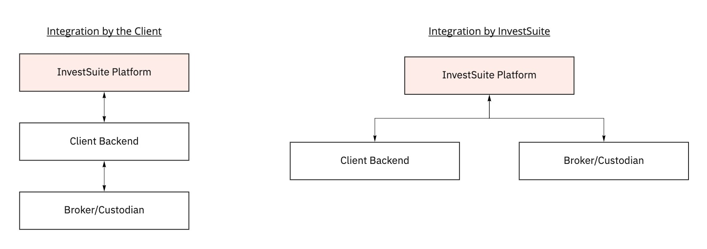

## Solution Architecture

## Integration Architecture

The InvestSuite platform is typically integrated with the following 3rd parties:

- **Client backend**, that masters accounts and users and many other things
- A **market data provider**, that provides instrument reference data and quotes.
- A **broker/custodian** to execute orders and holds instruments in custody.

Depending on the product, some integrations are required (:material-circle:), optional (:material-circle-outline:) or not required/supported (-).

|   | Client Backend | Market Data Provider | Broker/Custodian |
|---|:---:|:---:|:---:|
| Robo Advisor  | :material-circle: | :material-numeric-1-circle-outline: | :material-numeric-2-circle-outline: |
| Self Investor | :material-circle: | :material-circle: | :material-circle: |
| StoryTeller   | :material-numeric-3-circle-outline: | :material-numeric-1-circle-outline: |  - |
| Value Added APIs   | :material-numeric-3-circle-outline: | - | - |
| Portfolio Optimizer API  | :material-circle: | - | - |
| Suitability Profiler API  | :material-circle: | - | - |
| Model Builder  | - | - | - |

<!-- We are also considering making Optimizer stateless. I think that is where you draw the line between requiring a backend or not, right?
the stateless/stateful distinction is good -- i agree with the interpretation that stateless == does not require a backend (even though the only way to access the API is through your backend) -->

:material-numeric-1-circle-outline: Optional Market Data Provider

If all instrument data can be delivered through our Financial Data API (eg. when the instrument universe is only OTC/unlisted funds), then an integration with a Market Data Provider is not required.
:material-numeric-2-circle-outline: Robo Advisor with Broker/Custodian Integration

The default way of integrating Robo Advisor is through your backend, which is downstream integrated with the broker/custodian. This allows you to reuse your existing integration, remain in control of the end-to-end flow and avoid an organizational dependency on InvestSuite. This scenario is referred to as 'Broker integration by the Client' (ie. we give you order recommendations and you place them at the broker).

Alternatively, we can integrate with a supported broker/custodian. This scenario is referred to as 'Broker integration by InvestSuite' (ie. we place the orders at the broker).

## :material-numeric-3-circle-outline: Optional Client Backend

Data can delivered through an Excel file in the browser.

## Supported 3rd parties

|   | Preferred | Supported [1] |
|---|---|---|
| Market Data Provider | Refinitiv | Morningstar |
| Broker Custodian | Saxo | Any 3rd party that can comply with our Broker Agnostic API specification, either natively or through a custom 3rd party middleware |

[1] Typically we develop features first for our preferred 3rd parties with whom we have long standing partnerships. Supported 3rd parties are either lagging in features or may incur an additional implementation/integration cost.

Cedric Laridon  I like that you are thinking about this @Wouter Van Ranst! A few remarks:
This documentation might be confusing for clients/prospects and it misses an important point which is to direct customers (and internal employees) to “standard” configurations which are:
ARC : API driven (customer does the integration) and Refinitiv as data provider
Arab bank: connected with Saxo (a broker with whom we already have connections) and connected with Refinitiv
I suggest to change the naming of the two scenarios by adding “broker” to the name. E.g. “Broker integration by InvestSuite”
Not sure what you mean with number 3: Optional Client Backend
For Self Investor, it is very unlikely that InvestSuite will not have to do any integration (so even for scenario 1 where Client does broker integration, client will always expose some kind of API that we have to integrate with or at least make the mapping from our internal API to their API --> cfr. the scenario we discussed on Friday)

For more advanced scenarios, an API integration is required.

| Column 1                | Col 2 | Big row span   |
|:-----------------------:|-------| -------------- |
| r1_c1 spans two cols           || One large cell |
| r2_c1 spans two rows    | r2_c2 |                |
|_^                      _| r3_c2 |                |
|    ______ &#20;         | r4_c2 |_              _|