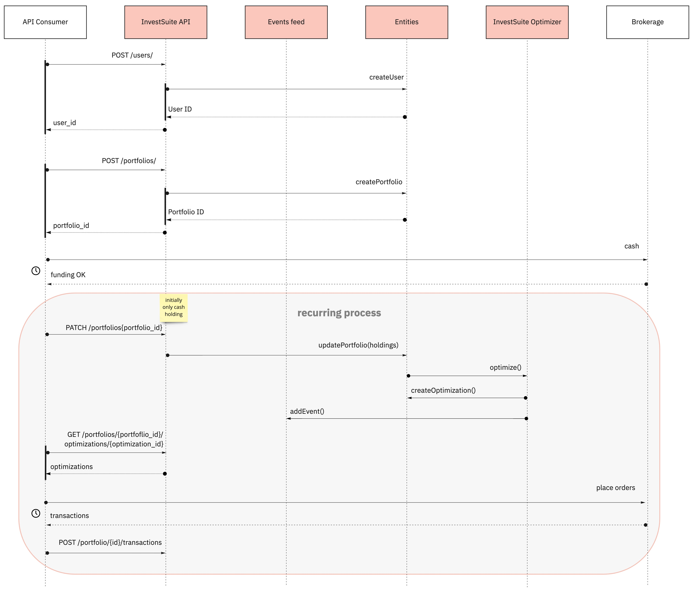

Get acquainted with the InvestSuite API. This quick start takes you through the typical steps to integrate with InvestSuite's Optimizer and Robo Advisor products. Below sequence diagram describes these basic steps. As a quick start, we will perform these steps interactively. 

!!! Hint
    This exercise demonstrates the flow for Robo Advisor. The flow for **Self Investor** is the same. The only difference is that for Self Investor you do not get to call the optimizer for order recommendations.

## Integration flow



Let's now get familiar with the API by simulating what is documented in the sequence diagram. These will be the steps: 

1. Create a user by invoking `POST /users/`.
2. Create a portfolio by invoking `POST /portfolios/`.
3. Update the portfolio with the latest portfolio snapshot (initially only a cash holding).
4. Get order recommendations as the result of an optimization, based on the holdings and portfolio settings.
5. Post the transactions you get back from your broker.
6. Repeat steps 4 - 7.

!!! Note
    As the sequence diagram reflects it is your role to act as the middle layer between InvestSuite and the broker (unless agreed differently during a common analyses). This means you get the orders and cash movement instructions via InvestSuite and place them with the broker. In the opposite direction, you provide to InvestSuite the holdings and the transactions from the broker. 
    
    Since this is a simulation however broker integration is not relevant. Instead we create a so-called _virtual portfolio_. This is a portfolio funded with _paper money_, as opposed to real money.

## Steps

### 1. Create a user

Create a user for your customer so that in the next step you can define that user as owner of a portfolio. 

=== "HTTP"

    ```HTTP 
    POST /users/ HTTP/1.1
    Host: api.sandbox.investsuite.com
    Accept-Encoding: gzip, deflate
    Connection: Keep-Alive
    Content-Type: application/json
    Authorization: Bearer {string}

    {
        "external_id": "unique_external_entity_id",
        "first_name": "Ashok",
        "last_name": "Kumar"
    }

    ```

=== "curl"

    ```bash
    curl --location --request POST 'https://api.sandbox.investsuite.com/users/' \
        --header 'Authorization: Bearer {string}' \
        --header 'Content-Type: application/json' \
        --data-raw '{
            "external_id": "ashok-kumar-1",
            "first_name": "Ashok",
            "last_name": "Kumar"
        }'
    ```

**Response body** 

```JSON
{
    "external_id": "unique_external_entity_id",
    "id": "U01ARZ3NDEKTSV4RRFFQ69G5FAV",
    "creation_datetime": "2021-02-18T08:21:02+00:00",
    "version": 3,
    "version_datetime": "2021-02-18T08:21:02+00:00",
    "version_authored_by_user_id": "U01ARZ3NDEKTSV4RRFFQ69G5FAV",
    "deleted": false,
    "first_name": "Ashok",
    "last_name": "Kumar"
}
```

!!! Hint
    Copy the User ID from the Response Body to use in the next step.

### 2. Create a portfolio

To optimize a portfolio that portfolio has to reference a _policy_, which is an investment strategy defined by the bank. Such strategy holds the constraints for the optimization algorithm to take into account when rendering order recommendations, for instance the minimum number of stocks within a certain sector or region. Select the `id` from the first policy returned by requesting `GET /policies/`.

=== "HTTP"

    ```HTTP hl_lines="11"
    GET /policies/ HTTP/1.1
    Host: api.sandbox.investsuite.com
    Authorization: Bearer {access_token_string}
    ```

=== "curl"

    ```bash
    curl -X GET 'https://api.sandbox.investsuite.com/policies/' \
    --H 'Authorization: Bearer {access_token_string}'
    ```

Once you have obtained the policy ID you can create a portfolio.

=== "HTTP"

    ```HTTP hl_lines="11"
    POST /portfolios/ HTTP/1.1
    Host: api.sandbox.investsuite.com
    Accept-Encoding: gzip, deflate
    Connection: Keep-Alive
    Content-Type: application/json
    Authorization: Bearer {string}

    {
        "base_currency":"USD",
        "config":{
            "manager":"ROBO_ADVISOR_DISCRETIONARY",
            "manager_version":1
            "manager_settings": {
                "policy_id":"Y01EF46X9XB437JS4678X0K529C",
            }
        },
        "external_id":"your-bank-portfolio-1",
        "money_type":"PAPER_MONEY",
        "owned_by_user_id":"U01F5WYKRRXZHXT9S6FF1JZNJVZ",
    }

    ```

=== "curl"

    ```bash
    curl --location --request POST 'https://api.sandbox.investsuite.com/portfolios/' \
        --header 'Authorization: Bearer {string}' \
        --header 'Content-Type: application/json' \
        --data-raw '{    
            "base_currency":"USD",    
            "config":{    
                "manager":"ROBO_ADVISOR_DISCRETIONARY",   
                "manager_version":1    
                "manager_settings": {    
                    "policy_id":"Y01EF46X9XB437JS4678X0K529C",    
                }  
            },  
            "external_id":"your-bank-portfolio-1",   
            "money_type":"PAPER_MONEY", 
            "owned_by_user_id":"U01F5WYKRRXZHXT9S6FF1JZNJVZ", 
        }'
    ```

Take a look at the request body... 

- You create a portfolio under a discretionary mandate: `config.manager="ROBO_ADVISOR_DISCRETIONARY"`. This sort of mandate comprehends that the portfolio is fully managed by the Robo Advisor, without the need for your customer to intervene. 
- Making it a “virtual portfolio” makes that paper money is used to simulate trades: `"money_type": "PAPER_MONEY"`.
- You assign the user you created in step 1 as owner: `"owned_by_user_id": "U01F5WYKRRXZHXT9S6FF1JZNJVZ"`.
- Selecting the applicable investment policy as management setting is required for the Robo Advisor's optimizer algorithm: `config.manager_settings.policy_id="Y01EF46X9XB437JS4678X0K529C"`.

**Response body**

```JSON
{
    "external_id": "your-bank-portfolio-1",
    "owned_by_user_id": "U01F5WYKRRXZHXT9S6FF1JZNJVZ",
    "base_currency": "USD",
    "money_type": "PAPER_MONEY",
    "config":{
        "manager": "ROBO_ADVISOR_DISCRETIONARY",
        "manager_version":1,
        "manager_settings": {
            "policy_id": "Y01EF46X9XB437JS4678X0K529C",
            "active": true
        }
    },
    "snapshot_datetime": null,
    "funded_since": null,
    "id": "P01F8ZSNV0J45R9DFZ3D7D8C26F",
    "creation_datetime": "2021-06-24T19:59:15.474241+00:00",
    "version": 1,
    "version_datetime": "2021-06-24T19:59:15.474241+00:00",
    "version_authored_by_portfolio_id": "U01EJQSYGYQJJ5GNFM4ZXW59Q0X",
    "deleted": false,
    "status": "WAITING_FOR_FUNDS"
}
```

Copy the Portfolio ID from the Response Body to use in the next step.

### 3. Fund the portfolio

Add an initial amount for the Robo Advisor to invest the portfolio you just created. To indicate a portfolio's holding to be the cash holding use the currency abbreviation defined in the ISO international standard 4217, e.g. AUD, and prefix it with the $-sign so `$AUD`. The currency to use is the one defined in the portfolio field `base_currency`.

=== "HTTP"

    ```HTTP hl_lines="1"
    PATCH /portfolios/P01F8ZSNV0J45R9DFZ3D7D8C26F/ HTTP/1.1
    Host: api.sandbox.investsuite.com
    Accept-Encoding: gzip, deflate
    Connection: Keep-Alive
    Content-Type: application/json
    Authorization: Bearer {string}

    {
        "holdings": {
            "$USD":10000
        }
    }

    ```

=== "curl"

    ```bash
    curl --location --request PATCH 'https://api.sandbox.investsuite.com/portfolios/P01F8ZSNV0J45R9DFZ3D7D8C26F/' \
        --header 'Authorization: Bearer {string}' \
        --header 'Content-Type: application/json' \
        --data-raw '{
            "holdings": {
                "$USD":10000
            }
        }'
    ```

Alongside the updated holdings with the cash position, register the cash deposit transaction.

=== "HTTP"

    ```HTTP hl_lines="1"
    POST /portfolios/P01F8ZSNV0J45R9DFZ3D7D8C26F/transactions/ HTTP/1.1
    Host: api.sandbox.investsuite.com
    Accept-Encoding: gzip, deflate
    Connection: Keep-Alive
    Content-Type: application/json
    Authorization: Bearer {string}

    {
        "external_id": "P01FFMGXDPSZ2HKZD4G55T6YHHD/2014087240",
        "movements": [
            {
                "external_id": "13891096285",
                "type": "CASH_DEPOSIT",
                "status": "SETTLED",
                "datetime": "2021-09-27T00:00:00+00:00",
                "instrument_id": "$USD",
                "quantity": 10000.0,
            }
        ],
    }

    ```

=== "curl"

    ```bash
    curl --location --request PATCH 'https://api.sandbox.investsuite.com/portfolios/P01F8ZSNV0J45R9DFZ3D7D8C26F/transactions/' \
        --header 'Authorization: Bearer {string}' \
        --header 'Content-Type: application/json' \
        --data-raw '{
                "external_id": "P01FFMGXDPSZ2HKZD4G55T6YHHD/2014087240",
                "movements": [
                    {
                        "external_id": "13891096285",
                        "type": "CASH_DEPOSIT",
                        "status": "SETTLED",
                        "datetime": "2021-09-27T00:00:00+00:00",
                        "instrument_id": "$USD",
                        "quantity": 10000.0,
                    }
                ],
            }'
    ```

**Response body**

```JSON
{
        "external_id": "P01FFMGXDPSZ2HKZD4G55T6YHHD/2014087240",
        "type": "CASH_TRANSFER",
        "order_type": null,
        "movements": [
            {
                "external_id": "13891096285",
                "type": "CASH_DEPOSIT",
                "sub_type": "Cash Deposit",
                "description": null,
                "status": "SETTLED",
                "datetime": "2021-09-27T00:00:00+00:00",
                "instrument_id": "$USD",
                "instrument_name": null,
                "quantity": 1.0,
                "quantity_portfolio_currency": 1.0,
                "reference_instrument_id": null,
                "reference_instrument_name": null,
                "reference_quantity": null,
                "unit_price": null,
                "reference_external_id": null,
                "original_external_id": null,
                "trade_type": null,
                "ex_dividend_date": null
            }
        ],
        "description": null,
        "id": "T01FGNG33GFJK5GCN4KZSPZYMFF",
        "creation_datetime": "2021-09-28T06:04:54.671046+00:00",
        "version": 1,
        "version_datetime": "2021-09-28T06:04:54.671046+00:00",
        "version_authored_by_user_id": "UXXXXXXXXXXXXXXXXXXXXXXXXXX",
        "deleted": false,
        "status": "COMPLETED"
    }
```

### 4. Recommended orders

Given you assigned a policy and an initial amount to the portfolio as part of the two previous steps, you can now issue a `GET` request to retrieve order recommendations for the portfolio you just initiated.

=== "HTTP"

    ```HTTP hl_lines="1"
    GET /portfolios/P01F8ZSNV0J45R9DFZ3D7D8C26F/optimization/ HTTP/1.1
    Host: api.sandbox.investsuite.com
    Accept-Encoding: gzip, deflate
    Connection: Keep-Alive
    Content-Type: application/json
    Authorization: Bearer {string}
    ```

=== "curl"

    ```bash
    curl -X GET \                 
    -H "Auhorization": "{string}"  \   
    https://api.sandbox.investsuite.com/portfolios/portfolios/P01F8ZSNV0J45R9DFZ3D7D8C26F/optimization/
    ```

**Response body**

```JSON
{
"current_solution":{
    "objective_value":-2.3899945188058256e-05,
    "portfolio":{
        "US78468R1014":3,
        "$USD":402.52
    },
    "look_through":{
        "asset_classes":{
            "alternatives":0.0,
            "bonds":1.0,
            "commodities":0.0,
            "stocks":0.0,
            "cash":0.0
        },
        "regions":{
            "bonds":{
            "asia_pacific_developed":0.0,
            "emerging":0.0,
            "europe_developed":0.0,
            "north_america":1.0
            },
            "stocks":{
            "asia_pacific_developed":0.0,
            "emerging":0.0,
            "europe_developed":0.0,
            "north_america":0.0
            }
        },
        "bond_types":null,
        "sectors":{
            "basic_materials":0.0,
            "consumer_cyclical":0.0,
            "consumer_defensive":0.0,
            "communication_services":0.0,
            "energy":0.0,
            "financial_services":0.0,
            "healthcare":0.0,
            "industrials":0.0,
            "real_estate":0.0,
            "technology":0.0,
            "utilities":0.0
        }
    }
},
"optimal_solution":{
    "objective_value":0.001359509844724587,
    "portfolio":{
        "US4642886612":0.76,
        "US78468R1014":3,
        "US4642863926":0.7381,
        "US46429B2676":3.7190000000000003,
        "US78468R2004":3.0000000000000004,
        "$USD":14.769662844999981
    },
    "look_through":{
        "asset_classes":{
            "alternatives":0.0,
            "bonds":0.7986485447656201,
            "commodities":0.0,
            "stocks":0.20135145523437992,
            "cash":0.0
        },
        "regions":{
            "bonds":{
            "asia_pacific_developed":0.0,
            "emerging":0.0,
            "europe_developed":0.0,
            "north_america":1.0
            },
            "stocks":{
            "asia_pacific_developed":0.09369676320272571,
            "emerging":0.0,
            "europe_developed":0.1799403747870528,
            "north_america":0.7263628620102215
            }
        },
        "bond_types":null,
        "sectors":{
            "basic_materials":0.046054619609495716,
            "consumer_cyclical":0.13806308600212508,
            "consumer_defensive":0.07094628258129534,
            "communication_services":0.022473042495950425,
            "energy":0.03446538322470511,
            "financial_services":0.16124155877170626,
            "healthcare":0.12224125679967916,
            "industrials":0.11992341101283713,
            "real_estate":0.0,
            "technology":0.2563740870896863,
            "utilities":0.02821727241251957
        }
    },
},
"portfolio_update":{
    "is_recommended":true,
    "orders":{
        "US4642886612":{
            "shares":0.76,
            "expected_share_price":130.09,
            "expected_transaction_cost":0.4943420000000001
        },
        "US4642863926":{
            "shares":0.7381,
            "expected_share_price":130.31,
            "expected_transaction_cost":0.48090905500000003
        },
        "US46429B2676":{
            "shares":3.719,
            "expected_share_price":26.58,
            "expected_transaction_cost":0.4942551
        },
        "US78468R2004":{
            "shares":3,
            "expected_share_price":30.64,
            "expected_transaction_cost":0.4596
        }
    }
},
"id":"O01FGNGNS3R3836WB3JHD22J748",
"creation_datetime":"2021-09-28T06:15:06.613287+00:00",
"version":1,
"version_datetime":"2021-09-28T06:15:06.613287+00:00",
"version_authored_by_user_id":"UXXXXXXXXXXXXXXXXXXXXXXXXXX",
"deleted":false,
}   
```

### 5. Post transactions

Simulate buy transactions for the orders the optimizer recommended in step 4 above, see `portfolio_update.orders` in the response body.

=== "HTTP"

    ```HTTP hl_lines="1"
    POST /portfolios/P01F8ZSNV0J45R9DFZ3D7D8C26F/transactions/ HTTP/1.1
    Host: api.sandbox.investsuite.com
    Content-Type: application/json
    Authorization: Bearer {string}

    [
        {
            "movements": [
                {
                    "type": "BUY",
                    "status": "SETTLED",
                    "datetime": "2021-09-24T06:15:01.999300+00:00",
                    "instrument_id": "US4642886612",
                    "quantity": 2,
                },
                {
                    "type": "SELL",
                    "status": "SETTLED",
                    "datetime": "2021-09-24T06:15:01.999300+00:00",
                    "instrument_id": "$USD",
                    "quantity": 125,
                }
            ]
        },
        {
            "movements": [
                {
                    "type": "BUY",
                    "status": "SETTLED",
                    "datetime": "2021-09-24T06:15:01.930643+00:00",
                    "instrument_id": "US4642863926",
                    "quantity": 3,
                },
                {
                    "type": "SELL",
                    "status": "SETTLED",
                    "datetime": "2021-09-24T06:15:01.999300+00:00",
                    "instrument_id": "$USD",
                    "quantity": 350.50,
                }
            ]
        }
    ]
    ```

=== "curl"

    ```bash
    curl -X POST \                 
    -H "Content-Type: application/json" \
    -H "Auhorization": "{string}"  \   
    -d '[
        {
            "movements": [
                {
                    "type": "BUY",
                    "status": "SETLLED",
                    "datetime": "2021-09-24T06:15:01.999300+00:00",
                    "instrument_id": "US4642886612",
                    "quantity": 2,
                },
                {
                    "type": "SELL",
                    "status": "SETLLED",
                    "datetime": "2021-09-24T06:15:01.999300+00:00",
                    "instrument_id": "$USD",
                    "quantity": 125,
                }
            ]
        },
        {
            "movements": [
                {
                    "type": "BUY",
                    "status": "SETTLED",
                    "datetime": "2021-09-24T06:15:01.930643+00:00",
                    "instrument_id": "US4642863926",
                    "quantity": 3,
                },
                {
                    "type": "SELL",
                    "status": "SETLLED",
                    "datetime": "2021-09-24T06:15:01.999300+00:00",
                    "instrument_id": "$USD",
                    "quantity": 350.50,
                }
            ]
        }
    ]'  \
    https://api.sandbox.investsuite.com/portfolios/P01F8ZSNV0J45R9DFZ3D7D8C26F/transactions/
    ```

### 6. Update holdings

Next update the portfolio to hold the acquired positions. This will trigger the optimizer anew. In principle the portfolio is now in line with the investment policy used by the optimizer returning no recommendations.

=== "HTTP"

    ```HTTP 
    PATCH /portfolios/P01F8ZSNV0J45R9DFZ3D7D8C26F/ HTTP/1.1
    Host: api.sandbox.investsuite.com
    Accept-Encoding: gzip, deflate
    Connection: Keep-Alive
    Content-Type: application/json
    Authorization: Bearer {string}

    "holdings": {
        "$USD": 208.086729,
        "US78464A6644": 18.78,
        "US4642886612": 9.2243,
        "US46137V2410": 9,
        "US3160923039": 3,
        "US3160928731": 10,
        "US97717W5215": 6,
        "US4642861458": 4,
        "US46429B2676": 45.146,
        "US46434V7617": 9,
        "US4642865251": 7.6828,
        "US46434V4234": 3
    }

    ```

=== "curl"

    ```bash
    curl -X PATCH \                 
    -H "Content-Type: application/json" \
    -H "Auhorization": "{string}"  \   
    -d '"holdings": { \ 
        "$USD": 208.086729, \ 
        "US78464A6644": 18.78, \ 
        "US4642886612": 9.2243, \ 
        "US46137V2410": 9, \ 
        "US3160923039": 3, \ 
        "US3160928731": 10, \ 
        "US97717W5215": 6, \ 
        "US4642861458": 4, \ 
        "US46429B2676": 45.146, \ 
        "US46434V7617": 9, \ 
        "US4642865251": 7.6828, \ 
        "US46434V4234": 3 \ 
    }'  \
    https://api.sandbox.investsuite.com/portfolios/P01F8ZSNV0J45R9DFZ3D7D8C26F/
    ```

**Response body**

```JSON
{
    "external_id": "your-bank-portfolio-1",
    "owned_by_user_id": "U01F5WYKRRXZHXT9S6FF1JZNJVZ",
    "base_currency": "USD",
    "money_type": "PAPER_MONEY",
    "config":{
        "manager": "ROBO_ADVISOR_DISCRETIONARY",
        "manager_version":1,
        "manager_settings": {
            "policy_id": "Y01EF46X9XB437JS4678X0K529C",
            "active": true
        }
    },
    "holdings": {
        "$USD": 208.086729,
        "US78464A6644": 18.78,
        "US4642886612": 9.2243,
        "US46137V2410": 9,
        "US3160923039": 3,
        "US3160928731": 10,
        "US97717W5215": 6,
        "US4642861458": 4,
        "US46429B2676": 45.146,
        "US46434V7617": 9,
        "US4642865251": 7.6828,
        "US46434V4234": 3
    },
    "snapshot_datetime": null,
    "funded_since": null,
    "id": "P01F8ZSNV0J45R9DFZ3D7D8C26F",
    "creation_datetime": "2021-06-24T19:59:15.474241+00:00",
    "version": 3,
    "version_datetime": "2021-06-24T19:59:15.474241+00:00",
    "version_authored_by_portfolio_id": "U01EJQSYGYQJJ5GNFM4ZXW59Q0X",
    "deleted": false,
    "status": "ACTIVE"
}
```

Now that there is an invested portfolio you can view the performance and a Monte Carlo simulation to display future performance, see how by taking a look at the API specification.

That’s it. If you made it so far well done! 👏👏👏 Next up, a bit more detail.

