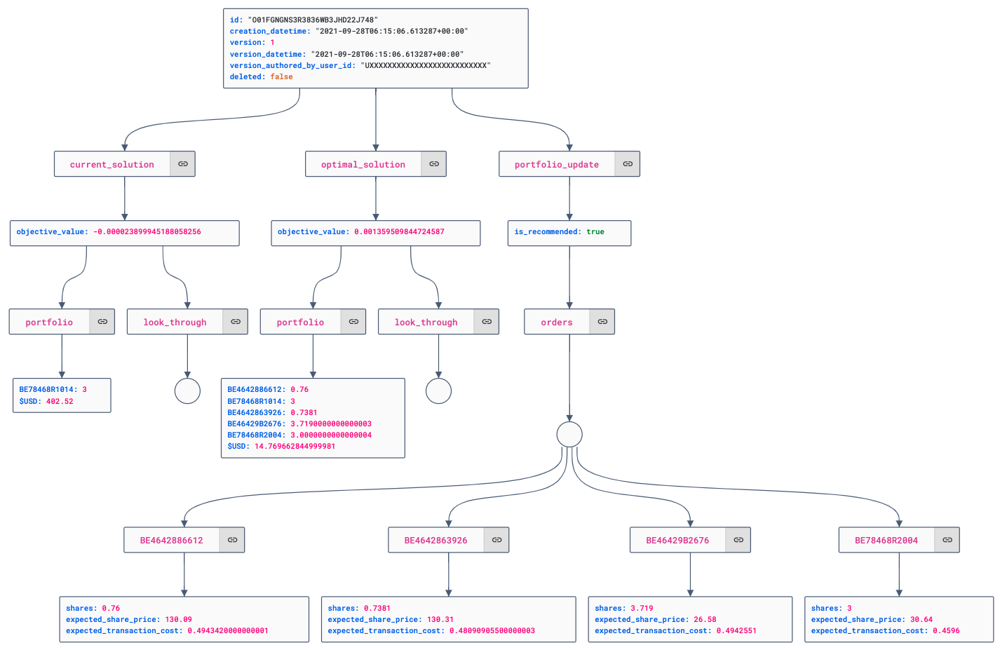

!!! info "Definition"

    See the [Glossary](../concepts/glossary.md#optimization-rebalancing-of-a-portfolio) for a definition.

## Context

This page lists all operations that can be performed on the Optimization object, see [Glossary](../concepts/glossary.md#optimization-rebalancing-of-a-portfolio).
## Concepts

### Object structure

The following image shows the object structure:

- Some metadata: id, version, ...
- The assessment of the as-is Portfolio (`current_solution`) and the recommended Portfolio (`optimal_solution`)
- The delta between the two, ie. what orders to place with the broker to get to the recommended Portfolio
- *Note that the `look_through` has been omitted in the image*



<!-- Embed of -- if this gets solved https://github.com/AykutSarac/jsoncrack.com/issues/171

{"current_solution":{"objective_value":-2.3899945188058256e-05,"portfolio":{"BE78468R1014":3,"$USD":402.52},"look_through":{}},"optimal_solution":{"objective_value":0.001359509844724587,"portfolio":{"BE4642886612":0.76,"BE78468R1014":3,"BE4642863926":0.7381,"BE46429B2676":3.7190000000000003,"BE78468R2004":3.0000000000000004,"$USD":14.769662844999981},"look_through":{}},"portfolio_update":{"is_recommended":true,"orders":{"BE4642886612":{"shares":0.76,"expected_share_price":130.09,"expected_transaction_cost":0.4943420000000001},"BE4642863926":{"shares":0.7381,"expected_share_price":130.31,"expected_transaction_cost":0.48090905500000003},"BE46429B2676":{"shares":3.719,"expected_share_price":26.58,"expected_transaction_cost":0.4942551},"BE78468R2004":{"shares":3,"expected_share_price":30.64,"expected_transaction_cost":0.4596}}},"id":"O01FGNGNS3R3836WB3JHD22J748","creation_datetime":"2021-09-28T06:15:06.613287+00:00","version":1,"version_datetime":"2021-09-28T06:15:06.613287+00:00","version_authored_by_user_id":"UXXXXXXXXXXXXXXXXXXXXXXXXXX","deleted":false}

 -->


## Create optimization

See the [Rebalancing](rebalancing.md#1-optimization-is-triggered) process to understand the triggers.

## Get optimization

Calculation of an optimization takes between 5 seconds and a couple of minutes depending on the complexity of the referenced investment policy, and the compute resources made available to the system. When calculation is in process the server returns a `202` response. Else the server returns a `200`, and an Optimization object.

### Get the latest optimization of a portfolio

=== "Request"

    ```HTTP
    --8<-- "robo/optimization.get-latest-optimization.request.http"
    ```

=== "Response (In Progress)"

    ```JSON
    202 Accepted
    {
        "message": "Optimization is not available (yet). Could not get optimization for optimization_hash.",
        "details": "Entity 'None' (version=None) not found for tenant 'None'",
        "optimization_hash": "8b22a2d4bdd142c6dca4ead3da80b4e8"
    }
    ```

=== "Response (Optimization Available)"

    ```JSON
    200 OK
    --8<-- "robo/optimization.get-latest-optimization.response.http"
    ```

=== "Response (Already Optimal)"

    ```JSON hl_lines="9"
    --8<-- "robo/optimization.get-latest-optimization-no-optimizations.response.http"
    ```


Field | Description | Data type | Example | Required
----- | ----------- | --------- | ------- | --------
`id` | Optimization ID	Unique ID for this portfolio. | `string ^O[0-9A-HJKMNP-TV-Z]{26}\Z` | O01FCB5EJQ9RWDK0SWRA17R87EN | yes
`{current|optimal_solution}->objective_value` | Objective Value	describes the degree of optimality of the portfolio. Portfolio Optimizer tries to minimise the objective value. | `number` | 0.00665 | yes
`{current|optimal_solution}->holdings` | The holdings in the portfolio to be optimized, or in the optimal portfolio. | `object` | `{"$USD":10000, "US0378331005": 20, "GB0005405286": 5}` | yes
`{current|optimal_solution}->look_through` | The look through values of the portfolio before and after optimization. | `object` |  | yes
`{current|optimal_solution}->portfolio_constraint_violations` | Percentage measure to indicate deviation from policy of the current and optimal solution. | `object` |  | yes
`{current|optimal_solution}->benchmark_constraint_violations` | Percentage measure to indicate deviation from policy of the current and optimal solution.| `object` |  | no
`portfolio_update->is_recommended` | Whether the portfolio update is recommended. True if there are reasons and applicable thresholds are passed, false otherwise.| `boolean` | TRUE | yes
`portfolio_update->orders->shares` | he number of shares to buy (if positive) or sell (if negative). | `number` | 20 | yes
`portfolio_update->orders->expected_share_price` | The share price at which the order is expected to be executed, expressed in the portfolio's base currency. | `number` | 100 | yes
`portfolio_update->orders->expected_transaction_cost` | The expected transaction cost for this order, expressed in the portfolio's base currency. | `number` | 2 | yes
`portfolio_update->reasons` | Reasons to update a portfolio | `object` |  | yes
`portfolio_update->reasons->portfolio_update_constraint_id` | The portfolio update constraint that is satisfied. | `string` | max_portfolio_constraint_violation_pctpoints | yes
`portfolio_update->reasons->portfolio_update_constraint_value` | The value of the portfolio update constraint. | `number` | 0.9 | yes
`portfolio_update->reasons->portfolio_constraint_id` | The id of the corresponding portfolio constraint. | `string` | holdings.cash | yes
`creation_datetime` | The date and time the first version of the entity was created. | `date-time` | 2025-06-04T15:23:15.328252+00:0 | yes

#### Share Price

The Orders part contains an `expected_share_price` and `expected_transaction_cost`. Since the Optimization process is inherently asynchronous, the share price may fluctuate.

We therefore recommend to include an Optimizer [Policy](policy.md) that always hold a small percentage in cash, to cover price fluctuations. 

Do explicitly check the price difference in the middleware.

Should the price difference be to great, or insufficient cash be available (due to bigger than expected price difference), update the Transaction with a `NOT_EXECUTED` status.

#### Quantity type

The `portfolio_update` section within an optimisation object can be configured on client level to return the quantity of instruments that need to be bought or sold in either `UNITS` or in `AMOUNT`:

* `UNITS` (default): for each instrument the quantity is set in *units* to be bought or sold.

* `AMOUNT`: for each instrument the quantity is set as an *amount* to be bought or sold EXCEPT when the position should be sold entirely. In that case, the quantity type for that position will be delivered in `UNITS`.

<!-- roald dixit we will hit the wall once the universe is split betw fractional an non fractional (ETF not in amount). Maarten Wyns has this in the backlog -->

=== "Response (Units)"

    ```JSON
    {
        "id": "P01F8ZSNV0J45R9DFZ3D7D8C26F",

        ...
        
        "portfolio_update":
        {
            "is_recommended": true,
            "orders": 
            {
                "IE00B44Z5B48": // Buy 5 units IE00B44Z5B48
                {
                    "quantity_type": "UNITS",
                    "quantity": 5,
                    "shares": 5,
                    "expected_share_price": 123.45,
                    "expected_transaction_cost": 25
                },
                "LU0378818131": // Partial or full sell LU0378818131
                {
                    "quantity_type": "UNITS",
                    "quantity": -8,
                    "shares": -8,
                    "expected_share_price": 54.32,
                    "expected_transaction_cost": 35
                }
            
            }
        }
    }
    ```

=== "Response (Amount)"

    ```JSON
    {
        "id": "P01F8ZSNV0J45R9DFZ3D7D8C26F",

        ...
        
        "portfolio_update":
        {
            "is_recommended": true,
            "orders": 
            {
                "IE00B44Z5B48": // Buy
                {
                    "quantity_type": "AMOUNT",
                    "quantity": 617.25,
                    "shares": 5,
                    "expected_share_price": 123.45,
                    "expected_transaction_cost": 25
                },
                "LU0378818131": // Partial Sell
                {
                    "quantity_type": "AMOUNT",
                    "quantity": -434.56,
                    "shares": -8,
                    "expected_share_price": 54.32,
                    "expected_transaction_cost": 35
                },
                "LU0378818131": // Full Sell
                {
                    "quantity_type": "UNITS",
                    "quantity": -11,
                    "shares": -11,
                    "expected_share_price": 54.32,
                    "expected_transaction_cost": 35
                }
            }
        }
    }
    ```


<!-- ## Update optimization

## Delete optimization

## Query optimization -->