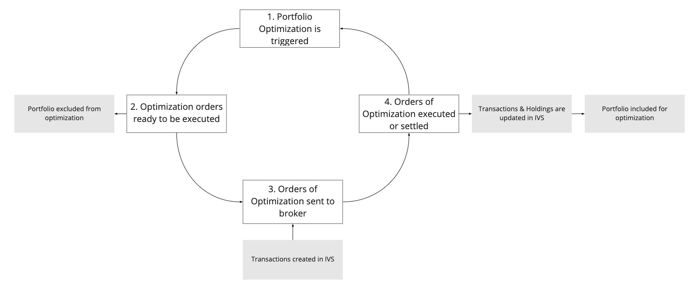

!!! info "Definition"

    See the [Glossary](../concepts/glossary.md#rebalancing) for a definition.

## Overview

The following diagram describes the rebalancing process at a high level.

<!-- Source: https://miro.com/app/board/uXjVOX6Q5tA=/?moveToWidget=3458764520791874643&cot=14 -->

## Process

Depending on the following criteria, the rebalancing process is different:

- Broker/Custodian integration: by InvestSuite or by the Client
- Mandate: Advisory or Discretionary
- Portfolio Optimizer: by InvestSuite or by the Client

<!-- | Broker/Custodian Integration | Mandate | Optimizer | Process Flow |
|---|---|---|---|
| Client | Discretionary | InvestSuite | (1) |
| Client | Discretionary | Client | (2) |
| Client | Advisory | InvestSuite | (3) |
| Client | Advisory | Client | (4) |
| InvestSuite | Discretionary | InvestSuite | (5) |
| InvestSuite | Discretionary | Client | (6) |
| InvestSuite | Advisory | InvestSuite | (7) |
| InvestSuite | Advisory | Client | (8) |

!!! info "Detailed process flow"

    Talk to your sales representative for a detailed process flow.

    Refer to https://investsuite.atlassian.net/wiki/spaces/PM/pages/2647752766/Rebalancing+in+Robo+Investor -->

### 1. Optimization is triggered

#### Client integrates with broker

When the Client integrates with the Broker, an Optimization is triggered when the Portfolio object is patched (with Holdings or Transactions):

- A funding happens, see [Funding](../scenarios/cash_movements.md#broker-integration-by-the-client).
<!-- - TODO what else? -->

#### InvestSuite integrates with broker

When InvestSuite integrates with the Broker, an Optimization is triggered by a nightly batch job, run by InvestSuite.

#### External Optimizer

The client (the external optimizer) decides when it runs.

### 2. Optimization is ready to be executed

#### Discretionary mandate

When an Optimization is recommended (the `portfolio_update.is_recommended` field on the Optimization is `true`), the Optimization is considered ready to be executed.

<!-- TODO quid owner_choice and status? -->

#### Advisory mandate

When the Optimization is accepted by the user (the `owner_choice` field on the Optimization is `ACCEPT`), the Optimization is considered ready to be executed.

#### Portfolio blocked

When an Optimization is considered ready to be executed, the Portfolio is blocked from being reoptimized.

### 3. Orders of Optimization sent to the broker

<!-- TODO what is the trigger here? an event? or a batch job? or a query? what criteria -->

#### Client integrates with broker

The Client middleware sends the Orders of the Optimization to the broker, and updates InvestSuite:

1. The Client middleware gets the Orders from the Optimization object, see [here](optimization.md#get-the-latest-optimization-of-a-portfolio).
2. The Client middleware sends the Orders to the broker.
3. The Client middleware creates corresponding Transactions in InvestSuite, see [here](../concepts/transactions.md#create-a-transaction).

#### InvestSuite integrates with the broker

InvestSuite sends the orders to the broker and keeps them up to date.

### 4. Orders are executed or settled

#### Client integrates with the broker

1. The Client middleware updates the corresponding Transactions in InvestSuite, see [here](../concepts/transactions.md#update-transaction).
2. The Client middleware updates the Portfolio holdings, see [here](../concepts/portfolios.md#holdings).

#### InvestSuite integrates with the broker

InvestSuite keeps the orders up to date.
#### The Portfolio is unblocked from being reoptimized

When all Transactions of an Optimization have a status `SETTLED`, the Portfolio is unblocked from being reoptimized.

<!-- also cancelled/expired/... -->
