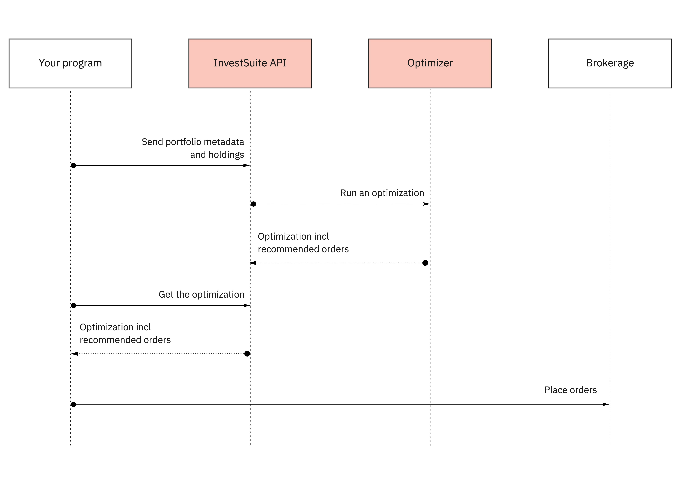

   
## Context

The Optimizer is an essential component of the InvestSuite Robo Advisor. It constructs out of an existing portfolio an optimal portfolio. For this, an algorithm is configured which will suggest a list of orders to be placed with the broker. These orders bring the portfolio in line with the optimal portfolio.

The default algorithm underpinning the Optimizer is called **iVar**. InvestSuite has developed iVar as a human-centric measure of risk. It is a 4th-generation risk measure that addresses the shortcomings of traditional risk measures, with a clear and distinct focus on controlling risk - over maximising return. Next to iVaR, all contemporary risk measures such as volatility, Value-at-Risk and conditional Value-at-Risk are supported.

!!! Info
    **What is iVaR?** 

    Traditional investment risk measures that are still used today, such as volatility, have historically been chosen because of their simple mathematical properties. They do not work well to describe the risk of real investment portfolios and are not consistent with what end investors perceive as risk.  Following the above observations, we developed a new, innovative risk measure which we call InvestSuite Value at Risk (iVaR). Our basic premise is that any instrument or portfolio providing strict monotonic growth (i.e., no losses) should be risk-less, regardless of the speed or consistency of the growth. The reason for this premise is that it matches the behaviour of a savings account, which also increases monotonically in value over time, and is considered risk-less by end investors. 

## Basic setup

The basic setup is straightforward:



1. From your program, or from a common mobile app, the portfolio's holdings are sent in a `PATCH` request. We pass that to the optimizer.
2. You issue a `GET` request, at your pace, against `/portfolios/{id}/optimizations/current/`. When the latest optimization is computed - takes between 5 seconds and 2 minutes - you receive order recommendations.
3. You place the orders with your broker. (unless we agreed that InvestSuite would connect to the broker)

## Example middleware design

<iframe width="100%" height="640" src="https://miro.com/app/live-embed/uXjVPbHnms8=/?moveToViewport=-1764,-1577,2749,1491&embedId=784475785527" frameborder="0" scrolling="no" allowfullscreen></iframe>


## Patch portfolio

Portfolios managed in the InvestSuite platform are either composed by the investor, i.e. Self Execution, or by the Robo Advisor. Management by the Robo Advisor can be under two mandates: an advisory mandate or a discretionary mandate. In case of an advisory mandate the investor can intervene on the Robo Advisor's order recommendations. In case of a discretionary mandate the Robo Advisor is in full charge of the rebalancing process, and the investor enjoys a full "auto pilot" mode.

Either way, each time a portfolio managed by the Robo Advisor is updated an optimization is triggered. In other words: **to trigger the optimizer, patch the portfolio.**

Prerequisites: prior to patching a portfolio, make sure there _is_ a portfolio referencing a policy, see [Portfolio creation](/docs/common_scenarios/account_initiation/#create-a-portfolio). Below example patches the portfolio by updating the holdings.

=== "Request"

    ```HTTP hl_lines="1"
    PATCH /portfolios/P01F8ZSNV0J45R9DFZ3D7D8C26F/ HTTP/1.1
    Host: api.sandbox.investsuite.com
    Accept-Encoding: gzip, deflate
    Connection: Keep-Alive
    Content-Type: application/json
    Authorization: Bearer {string}

    {
        "portfolio": {
            "$USD":10000,
            "US4642886612":0.76,
            "US78468R1014":3,
            "US4642863926":0.7381
        }
    }
    ```

=== "Response (body)"

    ```JSON hl_lines="10"
    {
        "external_id":"your-bank-portfolio-1",
        "name":"General investing",
        "owned_by_portfolio_id":"U01F5WYKRRXZHXT9S6FF1JZNJVZ",
        "base_currency":"USD",
        "money_type":"PAPER_MONEY",
        "config":{
            "manager":"ROBO_ADVISOR_DISCRETIONARY",
            "manager_version":1,
            "manager_settings":{
                "policy_id":"Y01EF46X9XB437JS4678X0K529C",
                "goal_id":"L01EF46X4872VVN0QRW4XF2ZP6W",
                "horizon_id":"H01EQ3429CY6Y2NW0ZF8A8Y2FYJ"
            }
        },
        "portfolio":{
            "$USD":10000,
            "US4642886612":0.76,
            "US78468R1014":3,
            "US4642863926":0.7381
        },
        "funded_since":null,
        "id":"P01F8ZSNV0J45R9DFZ3D7D8C26F",
        "creation_datetime":"2021-06-24T19:59:15.474241+00:00",
        "version":2,
        "version_datetime":"2021-06-24T19:59:15.474241+00:00",
        "version_authored_by_portfolio_id":"U01EJQSYGYQJJ5GNFM4ZXW59Q0X",
        "deleted":false,
        "status":"WAITING_FOR_FUNDS"
    }
    ```

This will now trigger an optimization.

## Get optimizations

Calculation of an optimization takes between 5 seconds and a couple of minutes depending on the complexity of the referenced investment policy, and the compute resources made available to the system. When calculation is in process the server returns a `202` response. Else the server returns a `200`, and an Optimization object.

Given you assigned a policy and at least a cash position to the portfolio, you can now issue a `GET` request to retrieve order recommendations for the portfolio you just initiated.

=== "HTTP"

    ```HTTP hl_lines="1"
    GET /portfolios/P01F8ZSNV0J45R9DFZ3D7D8C26F/optimizations/current/ HTTP/1.1
    Host: api.sandbox.investsuite.com
    Accept-Encoding: gzip, deflate
    Connection: Keep-Alive
    Content-Type: application/json
    Authorization: Bearer {string}
    ```

=== "curl"

    ```bash
    curl -X GET \                 
    -H "Auhorization": "{string}"  \   
    https://api.sandbox.investsuite.com/portfolios/portfolios/P01F8ZSNV0J45R9DFZ3D7D8C26F/optimizations/current/
    ```

**Response body upon calculation**

```JSON
{
    "message": "Optimization is not available (yet). Could not get optimization for optimization_hash.",
    "details": "Entity 'None' (version=None) not found for tenant 'None'",
    "optimization_hash": "8b22a2d4bdd142c6dca4ead3da80b4e8"
}
```

**Response body after calculation**

```JSON
{
"current_solution":{
    "objective_value":-2.3899945188058256e-05,
    "portfolio":{
        "US78468R1014":3,
        "$USD":402.52
    },
    "look_through":{
        "asset_classes":{
            "alternatives":0.0,
            "bonds":1.0,
            "commodities":0.0,
            "stocks":0.0,
            "cash":0.0
        },
        "regions":{
            "bonds":{
            "asia_pacific_developed":0.0,
            "emerging":0.0,
            "europe_developed":0.0,
            "north_america":1.0
            },
            "stocks":{
            "asia_pacific_developed":0.0,
            "emerging":0.0,
            "europe_developed":0.0,
            "north_america":0.0
            }
        },
        "bond_types":null,
        "sectors":{
            "basic_materials":0.0,
            "consumer_cyclical":0.0,
            "consumer_defensive":0.0,
            "communication_services":0.0,
            "energy":0.0,
            "financial_services":0.0,
            "healthcare":0.0,
            "industrials":0.0,
            "real_estate":0.0,
            "technology":0.0,
            "utilities":0.0
        }
    }
},
"optimal_solution":{
    "objective_value":0.001359509844724587,
    "portfolio":{
        "US4642886612":0.76,
        "US78468R1014":3,
        "US4642863926":0.7381,
        "US46429B2676":3.7190000000000003,
        "US78468R2004":3.0000000000000004,
        "$USD":14.769662844999981
    },
    "look_through":{
        "asset_classes":{
            "alternatives":0.0,
            "bonds":0.7986485447656201,
            "commodities":0.0,
            "stocks":0.20135145523437992,
            "cash":0.0
        },
        "regions":{
            "bonds":{
            "asia_pacific_developed":0.0,
            "emerging":0.0,
            "europe_developed":0.0,
            "north_america":1.0
            },
            "stocks":{
            "asia_pacific_developed":0.09369676320272571,
            "emerging":0.0,
            "europe_developed":0.1799403747870528,
            "north_america":0.7263628620102215
            }
        },
        "bond_types":null,
        "sectors":{
            "basic_materials":0.046054619609495716,
            "consumer_cyclical":0.13806308600212508,
            "consumer_defensive":0.07094628258129534,
            "communication_services":0.022473042495950425,
            "energy":0.03446538322470511,
            "financial_services":0.16124155877170626,
            "healthcare":0.12224125679967916,
            "industrials":0.11992341101283713,
            "real_estate":0.0,
            "technology":0.2563740870896863,
            "utilities":0.02821727241251957
        }
    },
},
"portfolio_update":{
    "is_recommended":true,
    "orders":{
        "US4642886612":{
            "shares":0.76,
            "expected_share_price":130.09,
            "expected_transaction_cost":0.4943420000000001
        },
        "US4642863926":{
            "shares":0.7381,
            "expected_share_price":130.31,
            "expected_transaction_cost":0.48090905500000003
        },
        "US46429B2676":{
            "shares":3.719,
            "expected_share_price":26.58,
            "expected_transaction_cost":0.4942551
        },
        "US78468R2004":{
            "shares":3,
            "expected_share_price":30.64,
            "expected_transaction_cost":0.4596
        }
    }
},
"id":"O01FGNGNS3R3836WB3JHD22J748",
"creation_datetime":"2021-09-28T06:15:06.613287+00:00",
"version":1,
"version_datetime":"2021-09-28T06:15:06.613287+00:00",
"version_authored_by_user_id":"UXXXXXXXXXXXXXXXXXXXXXXXXXX",
"deleted":false,
}   
```

Field | Description | Data type | Example | Required
----- | ----------- | --------- | ------- | --------
`id` | Optimization ID	Unique ID for this portfolio. | `string ^O[0-9A-HJKMNP-TV-Z]{26}\Z` | O01FCB5EJQ9RWDK0SWRA17R87EN | yes
`{current|optimal_solution}->objective_value` | Objective Value	describes the degree of optimality of the portfolio. Portfolio Optimizer tries to minimise the objective value. | `number` | 0.00665 | yes
`{current|optimal_solution}->holdings` | The holdings in the portfolio to be optimized, or in the optimal portfolio. | `object` | `{"$USD":10000, "US0378331005": 20, "GB0005405286": 5}` | yes
`{current|optimal_solution}->look_through` | The look through values of the portfolio before and after optimization. | `object` |  | yes
`{current|optimal_solution}->portfolio_constraint_violations` | Percentage measure to indicate deviation from policy of the current and optimal solution. | `object` |  | yes
`{current|optimal_solution}->benchmark_constraint_violations` | Percentage measure to indicate deviation from policy of the current and optimal solution.| `object` |  | no
`portfolio_update->is_recommended` | Whether the portfolio update is recommended. True if there are reasons and applicable thresholds are passed, false otherwise.| `boolean` | TRUE | yes
`portfolio_update->orders->shares` | he number of shares to buy (if positive) or sell (if negative). | `number` | 20 | yes
`portfolio_update->orders->expected_share_price` | The share price at which the order is expected to be executed, expressed in the portfolio's base currency. | `number` | 100 | yes
`portfolio_update->orders->expected_transaction_cost` | The expected transaction cost for this order, expressed in the portfolio's base currency. | `number` | 2 | yes
`portfolio_update->reasons` | Reasons to update a portfolio | `object` |  | yes
`portfolio_update->reasons->portfolio_update_constraint_id` | The portfolio update constraint that is satisfied. | `string` | max_portfolio_constraint_violation_pctpoints | yes
`portfolio_update->reasons->portfolio_update_constraint_value` | The value of the portfolio update constraint. | `number` | 0.9 | yes
`portfolio_update->reasons->portfolio_constraint_id` | The id of the corresponding portfolio constraint. | `string` | holdings.cash | yes
`creation_datetime` | The date and time the first version of the entity was created. | `date-time` | 2025-06-04T15:23:15.328252+00:0 | yes

## Portfolio is OK

A PS...Given you have gotten this far you could now do a little test. You could update the portfolio again with the positions from the `optimal_solution.portfolio` object. To do this patch the portfolio again, just like you did above. The result should be that `portfolio_update` no longer holds recommended orders, or at least states that `"is_recommended": false`. This means the Portfolio is OK and does not need to be rebalanced.