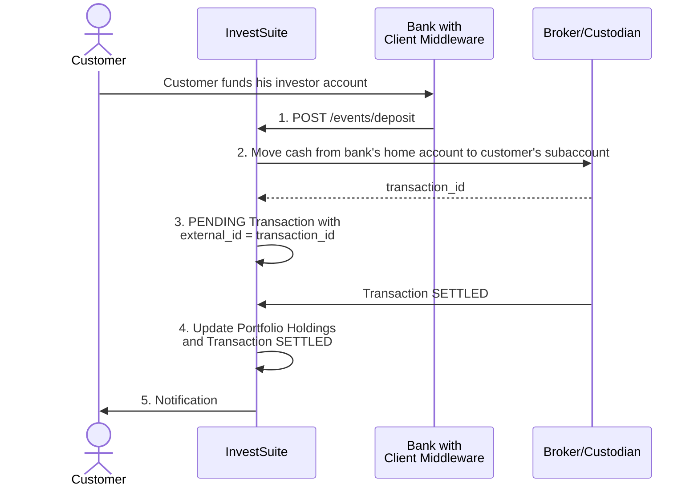
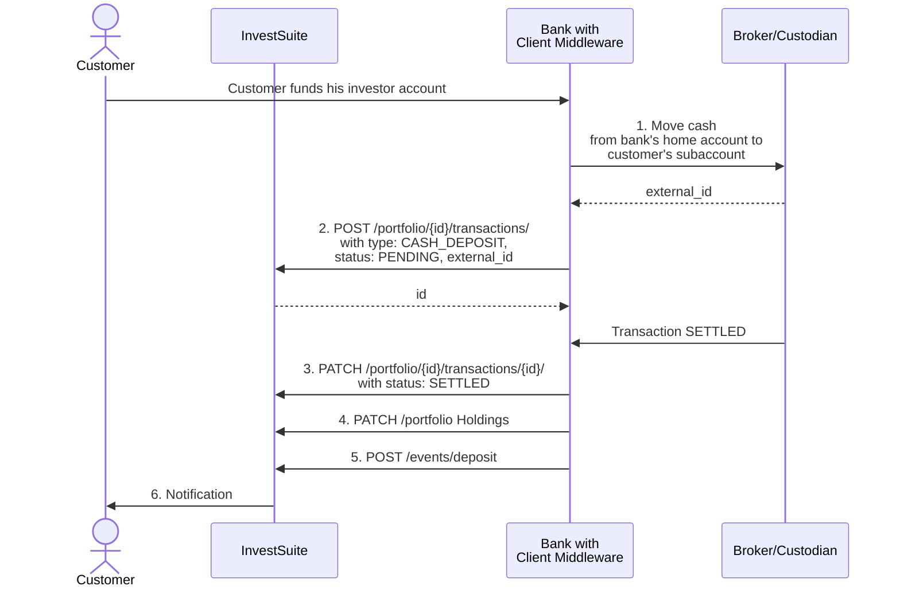
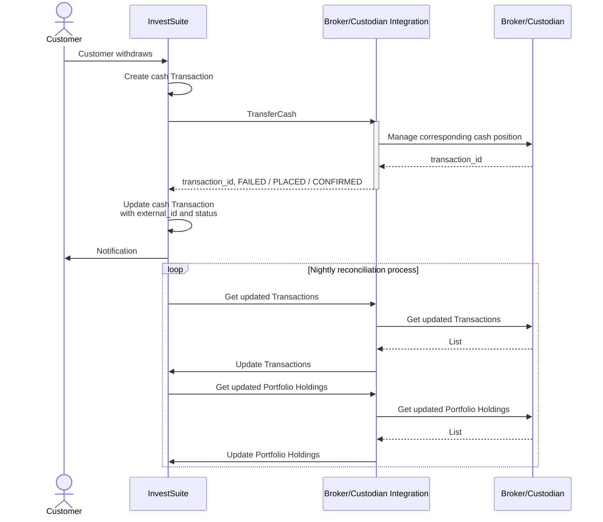

There are two sorts of cash transactions: deposits (funding) and withdrawals. Depending on (1) the direction (fund, withdraw) (2) the setup with the broker (who is integrated: you or InvestSuite), and (3) the selected product (Robo Advisor or Self Investor) you undertake one or several actions. These actions range from moving the money in the broker's account system, to making InvestSuite send a user notification. Below we describe in detail which actions to take, and which ones are taken on your behalf depending on the scenario.

## Funding

Funding a portfolio requires you to perform just one, or four steps depending on whether you or InvestSuite is integrated with the broker.

### Broker integration by InvestSuite

1. The **Client Middleware** notifies InvestSuite that the investor account at the Bank has been funded by calling `POST /events/deposit/` (see [here](../concepts/events.md#deposit-event)).
2. **InvestSuite** moves the cash at the broker from the bank's home account to the customer's subaccount.
3. **InvestSuite** creates a `PENDING` Transaction in InvestSuite, referring to the `transaction_id` of the broker in the `external_id` field.
4. Once the Transaction is settled at the broker, **InvestSuite** updates the Portfolio's cash holding and the Transaction status.
5. **InvestSuite** creates a notification to be sent to the client.



### Broker integration by the Client

1. The **Client Middleware** moves the cash at the broker from the bank's home account to the individual's subaccount.
2. The **Client Middleware** creates a `PENDING` Transaction in InvestSuite, referring to the `transaction_id` of the broker in the `external_id` field (see [here](../concepts/transactions.md#funding)).
3. Once the Transaction is settled at the broker, the **Client Middleware** updates the Transaction status to `SETTLED`. **See below**: Update transaction to settled.
4. The **Client Middleware** updates the portfolio's cash position (see [here](../concepts/portfolios.md#holdings)).
5. The **Client Middleware** call `POST /events/deposit/` (see [here](../concepts/events.md#deposit-event)).
6. **InvestSuite** creates a notification to be sent to the client.




**3. Update transaction to settled**

=== "HTTP"

    ```HTTP
    PATCH /portfolios/P01FGZK41MJ4NJXKZ27VJC0HGS9/transactions/T01FHCP1CZ9F1S207KJHNA5V244/ HTTP/1.1
    Host: api.sandbox.investsuite.com
    Content-Type: application/json
    Authorization: Bearer {string}

    {
        "movements": [
            {
                "status": "SETTLED"
            }
        ]
    }
    ```

=== "curl"

    ```bash
    curl --location --request PATCH 'https://api.sandbox.investsuite.com/portfolios/P01FGZK41MJ4NJXKZ27VJC0HGS9/transactions/T01FHCP1CZ9F1S207KJHNA5V244/' \
        --header 'Authorization: Bearer {string}' \
        --header 'Content-Type: application/json' \
        --data-raw '{
            "movements": [
                {
                    "status": "SETTLED",
                }
            ]
        }'
    ```
    
=== "curl"

    ```bash
    curl --location --request POST 'https://api.sandbox.investsuite.com/events/deposit/' \
    --header 'Content-Type: application/json' \
    --header 'Authorization: Bearer {string}' \
    --data-raw '{
                    "data": {
                        "amount": "1000",
                        "currency": "USD",
                        "portfolio": "P01F8ZSNV0J45R9DFZ3D7D8C26F"
                    }
                }'
    ```
## Withdrawal

### Robo Advisor

Cash withdrawal for Robo Advisor involves two phases:

1. Reserve the amount to be withdrawn by setting that amount in the portfolio `divest_amount` field. As such the amount is reserved and cannot be used for investing. Then you transfer the money from the user's account in your system to the `counter_account` saved in the user object referred to from `Portfolio->owned_by_user_id`.
2. When the money has in fact been withdrawn from the customer's account in your banking system, you alert InvestSuite by issuing `POST /events/withdraw/`. We then update the cash position, put the `divest_amount` field back to `null` and publish a notification event to the message broker to notify the user via front-end channels.

!!! Warning
    In certain cases the instruction to withdraw money comes from the front-end. It is the front-end integration that updates the `divest_amount` field, not your integration (remember: this API is designed for backend-to-backend communication). Still, it is you that has to transfer the cash from the user's account to the counter account. In that case you listen to our event queue to trigger such transfer. See diagram below.

#### Broker integration by InvestSuite

Steps to take when the clients issues an instruction to withdraw funds, and InvestSuite places sell orders to free up cash:

1. **You** (or InvestSuite in case the app is managed by InvestSuite) update the portfolio `divest_amount` by issuing a PATCH request against `/portfolios/{portfolioId}` when the client sets a divest amount in the app. **See below**: Set divest amount.
2. **InvestSuite** asynchronously performs a portfolio optimisation, resulting in one or more sell orders to free up cash.
3. In case of a advisory mandate (as opposed to a discretionary mandate, see [Portfolio creation](/common_scenarios/account_initiation/#create-a-portfolio)) the user confirms the sell orders. The confirmation is registered in the `owner_choice` field of the Optimization object.
4. **InvestSuite** places the sell orders at the broker.
5. **InvestSuite** updates the portfolio's cash holding on successful reception of settled transactions from the broker.
6. **InvestSuite** updates the divest amount to `0`.
7. **You** transfer the freed up cash from the broker to the client's `counter_account`. **See below**: Get counter account.
8. **You** notify InvestSuite that the payment has occurred. **See below**: Notify InvestSuite on successful cash transfer.
9.  **InvestSuite** puts the message on a queue to send a push notification to the client.

!!! Info
    As trigger to transfer the freed up cash you use the input from the broker, for instance be parsing end-of-day files.

**1. Set divest amount**

=== "HTTP"

    ```HTTP hl_lines="1"
    PATCH /portfolios/P01F8ZSNV0J45R9DFZ3D7D8C26F/ HTTP/1.1
    Host: api.sandbox.investsuite.com
    Accept-Encoding: gzip, deflate
    Connection: Keep-Alive
    Content-Type: application/json
    Authorization: Bearer {string}

    {
        "manager": {
            "manager_settings": {
                "divest_amount": 500
            }
        }
    }

    ```

=== "curl"

    ```bash
    curl --location --request PATCH 'https://api.sandbox.investsuite.com/portfolios/P01F8ZSNV0J45R9DFZ3D7D8C26F/' \
        --header 'Authorization: Bearer {string}' \
        --header 'Content-Type: application/json' \
        --data-raw '{
            "manager": {
                "manager_settings": {
                    "divest_amount": 500
                }
            }
        }'
    ```

**7. Get counter account**

=== "HTTP"

    ```HTTP hl_lines="1"
    GET /users/U01234567890123456789012345/ HTTP/1.1
    Host: api.investsuite.com
    Accept: application/json
    Accept-Encoding: gzip, deflate
    Connection: Keep-Alive
    ```

=== "curl"

    ```bash
    curl --location --request GET 'https://api.sandbox.investsuite.com/users/U01234567890123456789012345/' \
    --header 'Authorization: Bearer {string}' \
    ```
**Response body**

```JSON
{
    "external_id": "unique_external_entity_id",
    "first_name": "Ashok",
    "last_name": "Kumar",
    "email": "ashok.kumar@example.com",
    "phone": "+12345667",
    "counter_account": {
        "bank_account_number": "BE01234567891234",
        "bank_account_number_type": "IBAN",
        "bank_id": "IDQMIE2D",
        "bank_id_type": "BIC"
    },
    "id": "U01234567890123456789012345",
    "creation_datetime": "2021-06-24T19:59:15.474241+00:00",
    "version": 1,
    "version_datetime": "2021-06-24T19:59:15.474241+00:00",
    "version_authored_by_portfolio_id": "U01EJQSYGYQJJ5GNFM4ZXW59Q0X",
    "deleted": false,
}
```
**8. Notify InvestSuite on successful cash transfer**

=== "HTTP"

    ```HTTP
    POST /events/withdraw/ HTTP/1.1
    Host: api.sandbox.investsuite.com
    Content-Type: application/json

    {
        "data": {
            "amount": "1000",
            "currency": "USD",
            "portfolio": "P01F8ZSNV0J45R9DFZ3D7D8C26F"
        }
    }

    ```

=== "curl"

    ```bash
    curl --location --request POST 'https://api.sandbox.investsuite.com/events/withdraw/' \
    --header 'Content-Type: application/json' \
    --header 'Authorization: Bearer {string}' \
    --data-raw '{
                    "data": {
                        "amount": "1000",
                        "currency": "USD",
                        "portfolio": "P01F8ZSNV0J45R9DFZ3D7D8C26F"
                    }
                }'
    ```

#### Broker integration by the Client

Steps to take when the clients issues an instruction to withdraw funds, and you as the Client are in charge of the integration with the broker:

1. **You** (or InvestSuite in case the app is managed by InvestSuite) update the portfolio `divest_amount` by issuing a PATCH request against `/portfolios/{portfolioId}` when the client sets a divest amount in the app. **See below**: Set divest amount.
<!-- TODO the withdrawal request event is fired -->
2. **InvestSuite** asynchronously performs a portfolio optimisation, resulting in one or more sell orders to free up cash.
<!-- TODO the optimisations.status-update event is fired -->
<!-- if event -> GET PORTFOLIO. If cash holidings >= divest amount, execute the transfer / patch holdings / post transactions. If not - wait. -->
3. In case of a advisory mandate (as opposed to a discretionary mandate, see [Portfolio creation](/common_scenarios/account_initiation/#create-a-portfolio)) the user confirms the sell orders. The confirmation is registered in the `owner_choice` field of the Optimization object.
4. **You** place the sell orders at the broker.
5. **You** transfer the freed up cash from the broker to the client's `counter_account`. **See below**: Get counter account.
6. **You** notify InvestSuite that the payment has occurred. **See below**: Notify InvestSuite on successful cash transfer.
7. **InvestSuite** puts the message on a queue to send a push notification to the client.
8.  **You** create a `SETTLED` transaction, referring to the transaction ID created by the broker in the `external_id` attribute. **See below**: Create transaction.
9.  **You** update the portfolio's cash position. **See below**: Update cash position.
10. **You** reset the divest amount to notify InvestSuite that the cash that became available in the portfolio is ready to be invested.  **See below**: Reset divest amount.

**1. Set divest amount**

=== "HTTP"

    ```HTTP hl_lines="1"
    PATCH /portfolios/P01F8ZSNV0J45R9DFZ3D7D8C26F/ HTTP/1.1
    Host: api.sandbox.investsuite.com
    Accept-Encoding: gzip, deflate
    Connection: Keep-Alive
    Content-Type: application/json
    Authorization: Bearer {string}

    {
        "manager": {
            "manager_settings": {
                "divest_amount": 500
            }
        }
    }

    ```

=== "curl"

    ```bash
    curl --location --request PATCH 'https://api.sandbox.investsuite.com/portfolios/P01F8ZSNV0J45R9DFZ3D7D8C26F/' \
        --header 'Authorization: Bearer {string}' \
        --header 'Content-Type: application/json' \
        --data-raw '{
            "manager": {
                "manager_settings": {
                    "divest_amount": 500
                }
            }
        }'
    ```

**5. Get counter account**

=== "HTTP"

    ```HTTP hl_lines="1"
    GET /users/U01234567890123456789012345/ HTTP/1.1
    Host: api.investsuite.com
    Accept: application/json
    Accept-Encoding: gzip, deflate
    Connection: Keep-Alive
    ```

=== "curl"

    ```bash
    curl --location --request GET 'https://api.sandbox.investsuite.com/users/U01234567890123456789012345/' \
    --header 'Authorization: Bearer {string}' \
    ```
**Response body**

```JSON
{
    "external_id": "unique_external_entity_id",
    "first_name": "Ashok",
    "last_name": "Kumar",
    "email": "ashok.kumar@example.com",
    "phone": "+12345667",
    "counter_account": {
        "bank_account_number": "BE01234567891234",
        "bank_account_number_type": "IBAN",
        "bank_id": "IDQMIE2D",
        "bank_id_type": "BIC"
    },
    "id": "U01234567890123456789012345",
    "creation_datetime": "2021-06-24T19:59:15.474241+00:00",
    "version": 1,
    "version_datetime": "2021-06-24T19:59:15.474241+00:00",
    "version_authored_by_portfolio_id": "U01EJQSYGYQJJ5GNFM4ZXW59Q0X",
    "deleted": false,
}
```
**6. Notify InvestSuite on successful cash transfer**

=== "HTTP"

    ```HTTP
    POST /events/withdraw/ HTTP/1.1
    Host: api.sandbox.investsuite.com
    Content-Type: application/json

    {
        "data": {
            "amount": "1000",
            "currency": "USD",
            "portfolio": "P01F8ZSNV0J45R9DFZ3D7D8C26F"
        }
    }

    ```

=== "curl"

    ```bash
    curl --location --request POST 'https://api.sandbox.investsuite.com/events/withdraw/' \
    --header 'Content-Type: application/json' \
    --header 'Authorization: Bearer {string}' \
    --data-raw '{
                    "data": {
                        "amount": "1000",
                        "currency": "USD",
                        "portfolio": "P01F8ZSNV0J45R9DFZ3D7D8C26F"
                    }
                }'
    ```

**9. Update cash position**

=== "HTTP"

    ```HTTP hl_lines="1"
    PATCH /portfolios/P01F8ZSNV0J45R9DFZ3D7D8C26F/ HTTP/1.1
    Host: api.sandbox.investsuite.com
    Accept-Encoding: gzip, deflate
    Connection: Keep-Alive
    Content-Type: application/json
    Authorization: Bearer {string}

    {
        "portfolio": {
            "$USD":10000,
            "US4642886612":0.76,
            "US78468R1014":3,
            "US4642863926":0.7381
        }
    }

    ```

=== "curl"

    ```bash
    curl --location --request PATCH 'https://api.sandbox.investsuite.com/portfolios/P01F8ZSNV0J45R9DFZ3D7D8C26F/' \
        --header 'Authorization: Bearer {string}' \
        --header 'Content-Type: application/json' \
        --data-raw '{
            "portfolio": {
                "$USD":10000,
                "US4642886612":0.76,
                "US78468R1014":3,
                "US4642863926":0.7381
            }
        }'
    ```

!!! Warning
    Updating holdings requires you to **provide the complete overview of positions**. In other words, if you update an invested portfolio
    with only `"portfolio": { "$USD":10000 }` InvestSuite will assume all other positions were sold.

**8. Create transaction**

=== "HTTP"

    ```HTTP hl_lines="11"
    POST /portfolios/P01FGZK41MJ4NJXKZ27VJC0HGS9/transactions/ HTTP/1.1
    Host: api.sandbox.investsuite.com
    Content-Type: application/json
    Authorization: Bearer {string}

    {
        "external_id": "P01FHAR57WS6Q8AV1GH5EATYKP1/14031738752",
        "movements": [
            {
                "type": "CASH_WITHDRAWAL",
                "status": "SETTLED",
                "datetime": "2021-10-06T00:00:00+00:00",
                "instrument_id": "$USD",
                "quantity_type": "AMOUNT",
                "quantity": 500.0,
            }
        ]
    }
    ```

=== "curl"

    ```bash
    curl --location --request POST 'https://api.sandbox.investsuite.com/portfolios/P01FGZK41MJ4NJXKZ27VJC0HGS9/transactions/' \
        --header 'Authorization: Bearer {string}' \
        --header 'Content-Type: application/json' \
        --data-raw '{
            "external_id": "P01FHAR57WS6Q8AV1GH5EATYKP1/14031738752",
            "movements": [
                {
                    "type": "CASH_WITHDRAWAL",
                    "status": "SETTLED",
                    "datetime": "2021-10-06T00:00:00+00:00",
                    "instrument_id": "$USD",
                    "quantity_type": "AMOUNT",
                    "quantity": 500.0,
                }
            ]
        }'
    ```

**10. Reset divest amount**

=== "HTTP"

    ```HTTP hl_lines="1"
    PATCH /portfolios/P01F8ZSNV0J45R9DFZ3D7D8C26F/ HTTP/1.1
    Host: api.sandbox.investsuite.com
    Accept-Encoding: gzip, deflate
    Connection: Keep-Alive
    Content-Type: application/json
    Authorization: Bearer {string}

    {
        "manager": {
            "manager_settings": {
                "divest_amount": 0
            }
        }
    }

    ```

=== "curl"

    ```bash
    curl --location --request PATCH 'https://api.sandbox.investsuite.com/portfolios/P01F8ZSNV0J45R9DFZ3D7D8C26F/' \
        --header 'Authorization: Bearer {string}' \
        --header 'Content-Type: application/json' \
        --data-raw '{
            "manager": {
                "manager_settings": {
                    "divest_amount": 0
                }
            }
        }'
    ```

### Self Investor

#### Saxo

For Self Investor InvestSuite manages the app, and captures withdrawal instructions straight from the app. You as the Client transfer the cash to the client's counter account upon input from the broker, e.g. reading the broker's end of day files. Steps:

1. **InvestSuite** captures in the app the client withdraw instruction, and passes the instruction on to the broker.
2. **You** transfer the freed up cash from the broker to the client's `counter_account` (see [here](../concepts/users.md#get-a-user)).
3. **You** notify InvestSuite that the payment has occurred (see [here](../concepts/events.md#withdrawal-executed-event)).
4. **InvestSuite** puts the message on a queue to send a push notification to the client.

#### Broker/Custodian Agnostic

